# FR422 GeoSpaX Step-by-Step Guide: Four Maps

**Course:** FR422 Forest Wildlife and Habitat
**Semester:** 2, 2026
**Tool:** GeoSpaX (<https://geospax.in4metrix.dev>)
**Prerequisite:** Your species choice approved by the lecturer and your species GeoJSON issued to you

This guide walks you through creating all four required maps entirely in GeoSpaX, with no QGIS install needed. Record the GeoSpaX version (shown in the page footer) and today's date in your provenance table.

> **Full reference:** For detailed explanations of every tool, panel, and analysis method, see the [GeoSpaX User Guide](https://geospax.in4metrix.dev/userguide.html). For version history and release notes, see the [Changelog](https://geospax.in4metrix.dev/changelog.html).

> **Naming convention:** Throughout this guide, file names use the placeholder `Surname`. **Replace `Surname` with your actual surname** in every file name (e.g., `Moses_lab_...`, `Wari_lab_...`, `Bani_lab_...`). Do not submit files with the literal word "Surname" in the name.

> **Verified:** Every step in this guide was tested against the lab training file (`lab_Paradisaea_guilielmi_occurrences.geojson`, 128 GBIF records, Emperor Bird-of-paradise) using the live GeoSpaX application. The screenshots in the `screenshots/` folder show each step.

---

## Before You Start

### What you need

1. Your **issued species GeoJSON** file, sent to you by the lecturer via Google Drive (not the training file, not a classmate's file, not the built-in sample).
2. The **FR422_SHARED_DATA_2026.zip** file, shared on Google Classroom (same for all students).
3. The **training file** `lab_Paradisaea_guilielmi_occurrences.geojson`, shared on Google Classroom for the Week 9 lab session.
4. A web browser (Chrome, Firefox, or Edge). Internet access is needed for GeoSpaX and basemap tiles.
5. A notebook or text file to record class breaks, weights, and citations.

### How you get your species file

1. Open `FR422_Assignment_Species_List_2026.xlsx` (shared on Google Classroom). Go to the **Species list** sheet to see the 23 species you can choose from, with record counts and notes. Go to the **My pick** sheet and fill in the next empty row: column A for your name, column B for your student ID, column C to pick your species from the dropdown, column D for a backup species, and column E for today's date. Do not overwrite another student's row. First student to claim a species gets it. No two students the same species.
2. Email the lecturer your scientific name, common name, IUCN Red List category, and the date you checked it. Do this by the deadline.
3. The lecturer checks your choice against the **My pick** sheet. First approved, no two students the same species.
4. After approval, the lecturer sends **your** species GeoJSON to you via Google Drive (shared link or email attachment). The file is named `<Species>_occurrences.geojson` (e.g., `Harpyopsis_novaeguineae_occurrences.geojson`).
5. The full assignment brief is in `FR422_Assignment_Brief_Habitat_Conservation_Plan.docx`, posted on Google Classroom. This guide covers only the GIS practical (Part A, 12% of FR422).

> **Tip:** The **Species list** sheet in the Excel file has an amber row colour for species where Map 3 is exploratory (n or unique sites below 30). You are not marked down for fewer hot spots than a classmate with 1000 rows.

### Data files and where to find them

You will receive files through Google Classroom and Google Drive:

**1. Google Classroom (shared with all students)**

The following files are posted on Google Classroom for everyone:

**Table 1.** Files distributed to students via Google Classroom and Google Drive, and where to find each one.

| File | What it is |
| --- | --- |
| `FR422_Assignment_Brief_Habitat_Conservation_Plan.docx` | Full assignment brief and rubric |
| `FR422_Assignment_Species_List_2026.xlsx` | Excel workbook with species list, **My pick** sheet, and instructions |
| `FR422_GeoSpaX_Step_by_Step_Guide.docx` | This guide |
| `lab_Paradisaea_guilielmi_occurrences.geojson` | Week 9 lab training file (practice only) |
| `FR422_SHARED_DATA_2026.zip` | Shared GIS data package (rasters and vectors) |

**2. Google Drive (sent to you individually after your species choice is approved)**

The lecturer sends your species file directly to you. No one else receives your file:

**Table 2.** Species GeoJSON file sent individually to each student after species choice approval.

| File | What it is |
| --- | --- |
| `<Species>_occurrences.geojson` | Your assigned species occurrence data with environmental fields. This is the file you import into GeoSpaX for all four maps. |

### What is inside FR422_SHARED_DATA_2026.zip

Unzip this to a folder called `FR422_SHARED_DATA_2026`. Inside you will find:

**Table 3.** Contents of the FR422_SHARED_DATA_2026.zip package, organised by folder.

| Folder | File | Type | What it is |
| --- | --- | --- | --- |
| `BOUNDARIES` | `png_provinces.geojson` | Vector | PNG province boundaries (22 provinces, EPSG:4326) |
| `BOUNDARIES` | `png_boundary_valid.gpkg` | Vector | PNG national boundary (EPSG:4326) |
| `CLIMATE` | `PNG_BIO1_30s.tif` | Raster | WorldClim BIO1 annual mean temperature |
| `CLIMATE` | `PNG_BIO12_30s.tif` | Raster | WorldClim BIO12 annual precipitation |
| `CLIMATE` | `PNG_BIO15_30s.tif` | Raster | WorldClim BIO15 precipitation seasonality |
| `ELEVATION` | `PNG_elevation_2.5m.tif` | Raster | WorldClim elevation, 2.5 arc-minutes |
| `LANDCOVER` | `PNG_WorldCover_2021_10m.tif` | Raster | ESA WorldCover 2021 land cover, 10 m |
| `DERIVED` | `PNG_tree_cover_pct_30s_FR422.tif` | Raster | Tree-cover percentage proxy (0 to 100), derived from WorldCover class 10 |
| `PROTECTED_AREAS` | `PNG_protected_areas.gpkg` | Vector | WDPA protected-area polygons and points |
| `METADATA` | `SHARED_DATA_SOURCES.txt` | Text | Full source citations and licences |
| `METADATA` | `GBIF_processing_notes.txt` | Text | GBIF extraction and QC notes |

### Which files do you actually use in GeoSpaX?

For the four required maps, the environmental fields (`elevation_m`, `tree_cover_pct`, `rainfall_mm`, `bio1`, `bio15`, `worldcover_label`) are already embedded in your issued species GeoJSON. You do not need to load the shared rasters into GeoSpaX to complete Maps 1 through 4.

The shared rasters and vectors are for **optional extra analysis** if you want to:

- Load `png_provinces.geojson` as a base boundary layer for context.
- Load `PNG_protected_areas.gpkg` to check whether your points fall inside a protected area (cite the source if you do this).
- Load `PNG_tree_cover_pct_30s_FR422.tif` as a raster backdrop (but note the tree-cover values at each point are already in your species file's `tree_cover_pct` field).

**Do not** load `PNG_WorldCover_2021_10m.tif` as a national map. The land-cover class at each point is already in your species file's `worldcover_label` field.

### Training file (Week 9 lab, practice only)

`lab_Paradisaea_guilielmi_occurrences.geojson` (Emperor Bird-of-paradise, 128 records) is posted on Google Classroom. Everyone uses this file to practice the click-path before switching to their own issued species file. Do not submit maps made from the training file unless that is the species you were issued.

### If your species has fewer than 30 records or unique sites

Map 3 (Gi* or LISA) is exploratory. State the record count and unique-site count in your map caption. You are not marked down for fewer hot spots than a classmate with 1000 rows. The species list flags these cases: Students 02, 10, 16, and 18 have n or unique sites below 30.

### If your species occurs on both mainland and islands

Several species in the list have GBIF records on mainland PNG and also on islands (New Britain, New Ireland, Bougainville, Manus, Milne Bay islands). Check your attribute table `stateProvince` column to see if you have points on more than one landmass.

**If you have points on both mainland and islands, choose ONE landmass and use only that subset for all four maps.** This simplifies your workflow and produces a cleaner, more defensible analysis. You do not need to run separate analyses for each landmass.

**Which one to choose:**

- **Choose the landmass with more points.** More points mean a more reliable hull, better hot-spot detection, and a more meaningful habitat score. If you have 800 mainland points and 50 island points, choose the mainland.
- **If the island has a large, distinct population** (e.g., 200+ points on New Britain), you may choose the island instead - but only if you justify it in your report (e.g., "I chose the New Britain population because it is geographically isolated and faces different threats from the mainland").
- **State your choice in your report.** Write: "My species has records on both mainland PNG and New Britain. I chose the mainland subset (n = 800) for all four maps because it has the larger population. The island records (n = 50) are noted but not analysed."

#### Understanding this tool: Field Filter

**What it does:** The field filter subsets your layer by an attribute value. Select a field (e.g., `stateProvince`), then select a value (e.g., `Western`), and all analysis tools (convex hull, Gi*, calculate field) will operate only on the features matching that value. The filter is generic - you can filter by any field, not just `stateProvince`.

**Why this assignment uses it:** A single convex hull drawn around points spanning mainland PNG and New Britain will include hundreds of kilometres of ocean - meaningless for a forest species. Filtering by `stateProvince` lets you isolate one landmass and run all your analysis on that subset only, producing a hull that reflects the actual land distribution. This is not a manual editing trick - the tool subsets the data programmatically.

**What it means in real-world conservation:** Subsetting analysis by administrative boundaries, ecological zones, or landmass type is standard practice. Real conservation plans are often stratified by province, watershed, or island group because each has different threats, land tenure systems, and management authorities. In PNG, a conservation plan for a species on the mainland (where logging and agriculture are the main threats) will differ from a plan for the same species on New Britain (where palm oil expansion and volcanic hazards are more relevant). Choosing one stratum and planning for it is more practical than trying to plan for everything at once.

GeoSpaX has a **field filter** in the Analysis drawer (below the layer selector). It has two dropdowns: first select the **field** to filter by (for example, `stateProvince`), then select the **value** to keep (for example, Western). Once set, the filter stays active for all analysis tools - convex hull, Gi*, calculate field, and all other tools will operate only on the filtered subset.

**How to apply the filter for all four maps:**

1. **Check your data:** Open the Attribute Table and look at the `stateProvince` column. Count how many points are on each landmass. Choose the landmass with more points.
2. **Set the filter:** In the Analysis drawer, set the field filter to `stateProvince` and select your chosen landmass value (for example, `Western` for mainland, `West New Britain` for islands).
3. **Keep the filter on for all four maps.** Do not remove it between maps. Every map (1-4) will be based on the same subset.
4. **Record the filter in your provenance table.** Write: "Filtered by stateProvince = [your chosen value], n = [filtered point count] out of [total] total records."
5. **Do not** manually redraw the hull to exclude ocean. Use the field filter to subset your points and let GeoSpaX compute the hull for your chosen subset.

Species most likely to span mainland and islands: Students 01, 03, 07, 09, 11, 13, 14, 15, 17, 19, 20, 21, and 23. Check your data to confirm.

> **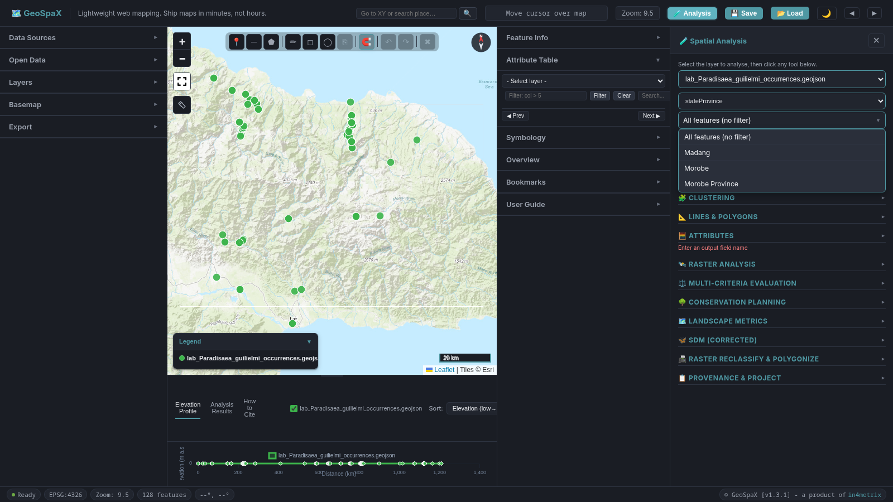**
>
> **Figure 1.** Field filter dropdown in the Analysis drawer, showing the stateProvince field selected for filtering by landmass.
>
> ****
>
> **Figure 2.** Convex hull computed on the mainland subset (stateProvince = Western), showing the hull boundary around filtered occurrence points.
>
> **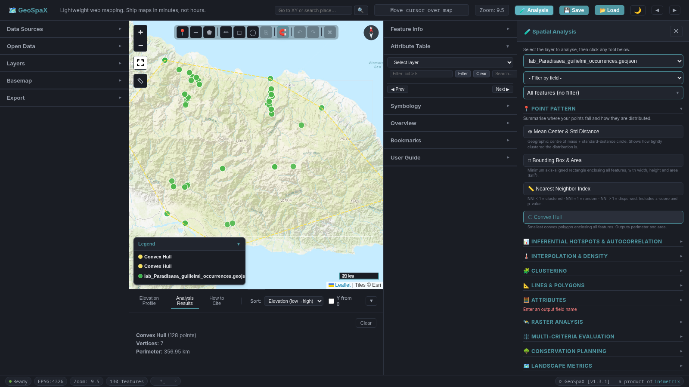**
>
> **Figure 3.** Convex hull computed on the West New Britain subset, demonstrating the island-only analysis path.
>
> **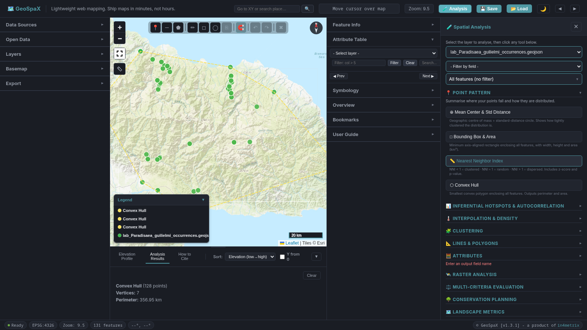**
>
> **Figure 4.** Convex hull computed on all points without a filter, showing how mainland-plus-island points produce a hull that includes ocean.

### Open GeoSpaX

1. Go to <https://geospax.in4metrix.dev> in your browser.
2. Record the **version number** from the page footer and the **access date**. You will need these for your provenance table.

> **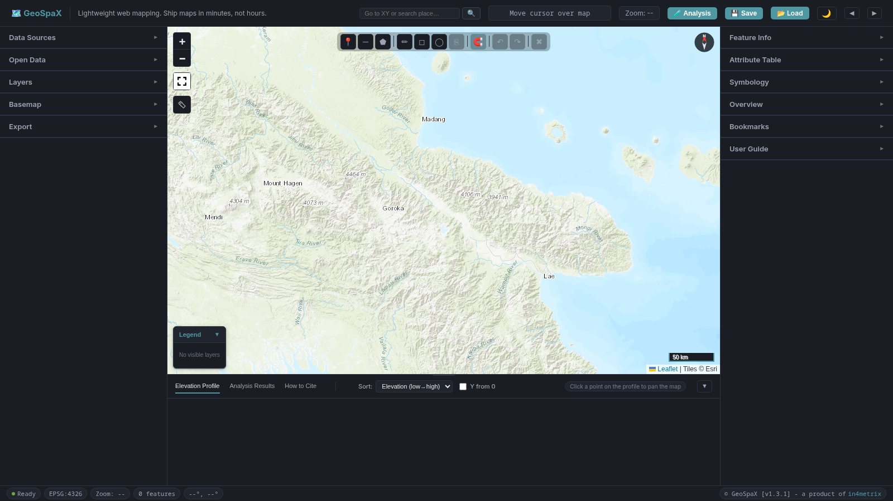**
>
> **Figure 5.** GeoSpaX home page on first load, showing the empty map canvas, top toolbar, and collapsible left and right panels.

### GeoSpaX panel layout

GeoSpaX has three main areas. Knowing where each tool lives will save you time:

**Table 4.** GeoSpaX panel layout showing the location and purpose of each UI area.

| Location | Panels / sections | What you do here |
|----------|-------------------|------------------|
| **Left panel** | Data Sources, Open Data, Layers, Basemap, Export (🗺️ Map Image, 📄 Per-Layer Export, 📈 Elevation Profile, 📦 Bulk Data Export) | Import files, manage layers, change basemap, export map as PNG/PDF (via Map Composer), export layer data |
| **Right panel** | Feature Info, Attribute Table, Symbology, Overview, Bookmarks | Inspect feature properties, view/edit attribute table, style layers, see overview map (click minimap to pan main map, double-click to zoom) |
| **Analysis drawer** (right side, opens on demand) | 🧪 Analysis drawer with 13 sections: 📍 Point Pattern, 📊 Inferential Hotspots & Autocorrelation, 🌡️ Interpolation & Density, 🧩 Clustering, 📐 Lines & Polygons, 🧮 Attributes, 🛰️ Raster Analysis, ⚖️ Multi-Criteria Evaluation, 🌳 Conservation Planning, 🗺️ Landscape Metrics, 🦌 SDM, 📠 Raster Reclassify & Polygonize, 📋 Provenance & Project | Click the 🧪 **Analysis** button in the top toolbar to open this drawer. Contains all analysis tools. The drawer is hidden by default and slides in next to the right panel when opened. |
| **Bottom panel** | Elevation Profile, Analysis Results, How to Cite | View analysis results (after running a tool), elevation profiles, and citation formats. Switch tabs at the top of the panel. |

**To open the Analysis drawer:** Click the 🧪 **Analysis** button in the top toolbar. The drawer slides in on the right side, next to the Feature Info panel. Click the ✕ button to close it.

**To view analysis results:** After running any analysis tool, click the **Analysis Results** tab in the bottom panel.

**To view a layer's fields:** Right-click any layer in the **Layers** section of the left panel and select 📄 **View Fields** from the context menu. A modal opens showing every field in the layer with its name, type, description, source, and sample values. This is the quickest way to check what fields your layer has and what the values look like before running analysis.

**Layer row buttons (visible on each layer in the Layers section):** ☰ Drag to reorder · 👁 Toggle visibility · 🔍 Zoom to layer · ✏ Rename · 📄 View fields · 🏷 Show/hide labels · × Remove

**Layer context menu (right-click a layer for more options):** 🔍 Zoom to Layer · ✏ Rename · 👁 Show/Hide Layer · ▲▼ Move Up/Down · ⤒⤓ Move to Top/Bottom · 🎨 Edit Symbology · 📋 Open Attribute Table · 📄 View Fields · 🗑 Remove Layer

### Import your species file

#### Understanding this step: GeoJSON Import and Attribute Table

**What it does:** GeoSpaX imports GeoJSON files - the open standard for geographic data on the web. Each feature (point, line, or polygon) has a geometry and a set of properties (attributes). Your species file contains point features (one per GBIF occurrence record) with properties like `site`, `gbifID`, `elevation_m`, `tree_cover_pct`, `rainfall_mm`, `bio1`, `worldcover_label`, and `year`. The Attribute Table lets you inspect these properties in a spreadsheet-like view with pagination, search, and sorting.

**Why this assignment uses it:** Before running any analysis, you must verify that you have the correct file with the correct fields. The Attribute Table is your quality-control checkpoint: confirm the feature count matches what the lecturer told you, confirm the environmental fields are present, and check for unexpected values (nulls, zeros, extreme values). If the count or fields do not match, you have the wrong file and should stop.

**What it means in real-world conservation:** Data verification is the first step in any GIS workflow. In a real conservation project, you would check the coordinate system, the date range of records, the taxonomy (is the species identification correct?), and the spatial coverage (are there gaps or clustering artefacts?). The GBIF data in your file are teaching extracts - they are not a complete census of the species' occurrence. Understanding what is in your data (and what is not) is essential for honest interpretation of all subsequent maps.

1. In the **left panel**, open **Data Sources** (click the section header to expand it) or simply **drag your issued species file onto the map**.
2. If using the file picker, click the **Drag & drop files here** zone and select the `<Species>_occurrences.geojson` file the lecturer sent you via Google Drive. If you are practising in the Week 9 lab, use `lab_Paradisaea_guilielmi_occurrences.geojson` from Google Classroom instead.
3. The map zooms to your species points. The layer appears in the **Layers** panel (left side).
4. **Checkpoint:** Open **Attribute Table** (right panel, "Attribute Table" section header). Select your layer from the dropdown. Confirm the feature count matches your issued file. Check the fields are present: `site`, `gbifID`, `elevation_m`, `tree_cover_pct`, `rainfall_mm`, `bio1`, `worldcover_label`, `year`. The table shows 50 rows per page with **Prev** and **Next** buttons at the bottom. Use the **Search** box to filter rows by any text (for example, type a province name to see only records from that province).
   - **Alternative:** Right-click the layer in the **Layers** section (left panel) and select **📄 View Fields** to see all field names, types, descriptions, and sample values in a single table.
5. If the count or fields do not match, you have the wrong file. Stop and reload the correct issued file.

> **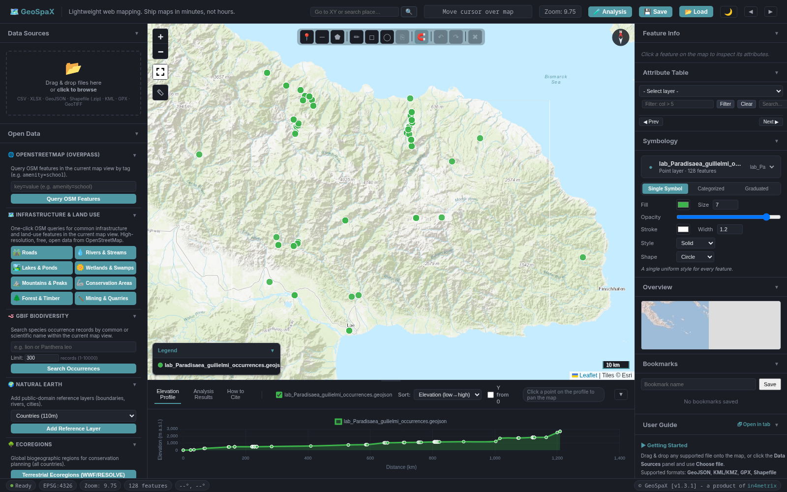**
>
> **Figure 6.** Species occurrence points imported into GeoSpaX. The map auto-zooms to the data extent and the layer appears in the Layers panel.
>
> **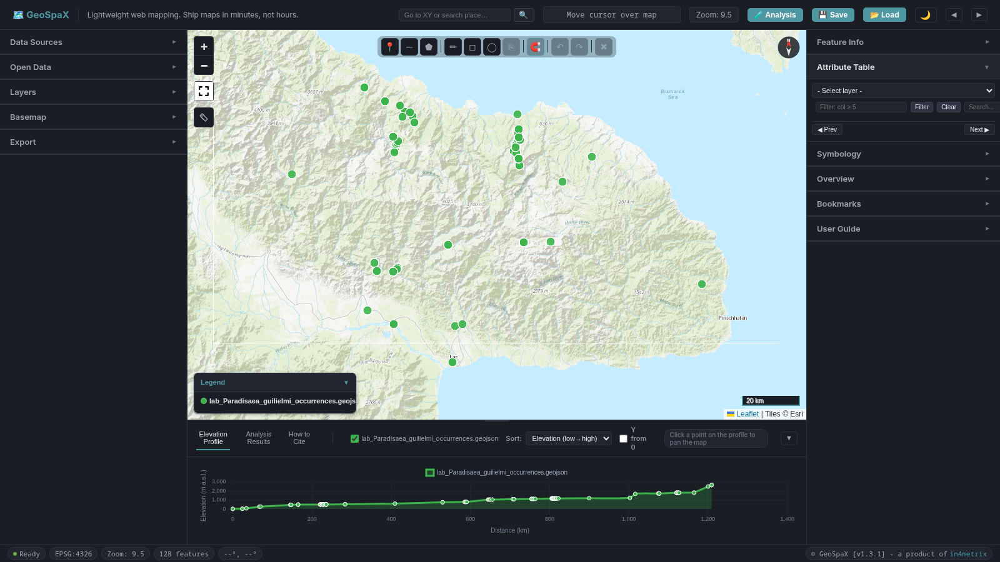**
>
> **Figure 7.** Attribute Table showing paginated species records (50 rows per page) with Prev/Next navigation and a search box for filtering rows.

### Export to the correct UTM zone (analysis CRS)

#### Understanding this step: Coordinate Reference Systems

**What it does:** A Coordinate Reference System (CRS) defines how coordinates on a flat map relate to positions on the Earth's surface. EPSG:4326 (WGS 84) uses latitude and longitude in degrees - it is the default for GPS, GBIF, and web maps. UTM (Universal Transverse Mercator) divides the Earth into 60 zones, each 6° of longitude wide, numbered 1-60 from west to east. Each zone has a northern (N) and southern (S) half. The correct UTM zone for your data depends on where your species occurs:

**Table 5.** UTM zone lookup by longitude range for Papua New Guinea, with corresponding EPSG codes.

| Longitude range | UTM zone | Example EPSG (South) | Example EPSG (North) |
|-----------------|----------|---------------------|---------------------|
| 138°E to 144°E | 54 | EPSG:32754 | EPSG:32654 |
| 144°E to 150°E | 55 | EPSG:32755 | EPSG:32655 |
| 150°E to 156°E | 56 | EPSG:32756 | EPSG:32656 |

For PNG (southern hemisphere), use the 327xx codes. For northern hemisphere locations, use 326xx codes. Each UTM zone uses metres in a flat projected grid, so distances and areas are accurate within that zone. **You must use the zone that covers your species' data.** Using the wrong zone introduces distortion because the data is far from the zone's central meridian.

**How to find your correct UTM zone:** GeoSpaX auto-detects it for you. Open the **Export** panel, expand the **📄 Per-Layer Export** section, and select your species layer. The **Output CRS** dropdown and the auto-detect hint are located **under the 📄 Per-Layer Export section** (not at the top of the export panel). When you select a layer, a hint appears below the Output CRS dropdown showing your data's centroid longitude and latitude, and the correct UTM zone (e.g., "Your data centroids at 147.1°E, 6.1°S → UTM Zone 55S (EPSG:32755). Click to select."). Click the link to auto-select the correct CRS. If the zone is not already in the dropdown, GeoSpaX adds it automatically.

**Why this assignment requires it:** Distance-based analysis (Gi* distance bands, buffer widths, hull perimeter) is only accurate when computed in a projected CRS with metres as units. Computing distances in degrees (EPSG:4326) produces wrong values because one degree of longitude at the equator is about 111 km, but one degree at the poles is zero. UTM uses metres, so a distance band of 53.87 km means exactly 53,870 metres on the ground.

**What it means in real-world conservation:** Every published conservation plan, protected-area proposal, and environmental impact assessment specifies its CRS. Using the wrong CRS is one of the most common errors in GIS - it produces silently wrong area and distance measurements. In a real conservation plan, the CRS choice is documented in the methods section and all reported measurements (hectares, kilometres) are computed in that CRS. The assignment mirrors this requirement: you must export to the correct UTM zone for your data and report all measurements in that CRS.

#### Steps to export

1. Open the **Export** section in the **left panel** (expand the Export section header).
2. Expand the **📄 Per-Layer Export** section. The **Output CRS** dropdown and the auto-detect hint are located **inside this section**.
3. Select your species layer from the dropdown at the top of the Per-Layer Export section.
4. **Type a filename** in the **Output filename** field using the convention: `Surname_lab_species_points_utmXXS_WGS84` (e.g., `Moses_lab_birdofparadise_points_utm55S_WGS84`). **Replace `Surname` with your actual surname** (e.g., `Moses`, `Wari`, `Bani`). This rich filename tells you and anyone else exactly what the file contains: whose assignment it is, what species, what geometry type, what UTM zone, and what datum. The field auto-fills with the layer name, but you should replace it with this convention. You can also click the "Click to use" link in the hint to auto-fill the suggested name, then edit it to replace `Surname` with your actual surname.
5. **Look at the hint below the Output CRS dropdown** - it shows your data's centroid longitude and the correct UTM zone. **Click the link** to auto-select it.
6. If the hint does not appear, manually select the correct UTM zone from the **Output CRS** dropdown. For PNG species, use:
   - **UTM Zone 54S / WGS 84 (PNG west, EPSG:32754)** - if your data is west of 144°E
   - **UTM Zone 55S / WGS 84 (PNG central, EPSG:32755)** - if your data is between 144°E and 150°E
   - **UTM Zone 56S / WGS 84 (PNG east, EPSG:32756)** - if your data is east of 150°E
   
   For data outside PNG, use the **Custom EPSG code** option and enter the correct EPSG code (e.g., 32618 for UTM Zone 18N / New York).
7. Set **Format** to **GeoJSON**.
8. Click **💾 Export Layer**. The file downloads as `Surname_lab_species_points_utmXXS_WGS84.geojson` (using the filename you typed in step 4).
9. This reprojected file is your working copy for all four maps. Remove the original layer and re-import the reprojected file so all analysis runs on the reprojected version.
10. **Record the EPSG code** in your provenance table (e.g., "Exported to EPSG:32755, UTM Zone 55S").

> **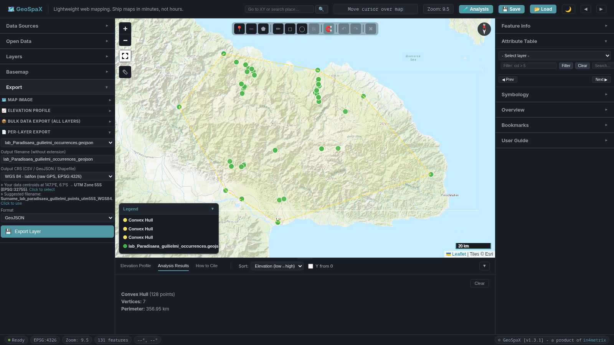**
>
> **Figure 8.** Export panel with the Per-Layer Export section expanded, showing the Output CRS dropdown and the UTM auto-detect hint.
>
> **Note:** GeoSpaX computes distances using auto-UTM projection (the Gi* results panel confirms the zone automatically, e.g., "UTM 55S"), so analysis results are accurate regardless of the display CRS. The export ensures your submitted data file matches the correct UTM zone for your data.

---

## Map 1: Study Area and Sites

**Required:** Convex hull, points with site labels, legend, scale bar, north arrow, CRS text, source line.
**File name:** `Surname_lab_map1_study_area.pdf`

### Understanding this tool: Convex Hull

**What it does:** A convex hull is the smallest polygon that encloses all your points, like stretching a rubber band around the outermost points. It does not follow coastlines or rivers - it is a pure geometric shape.

**Why this assignment uses it:** The hull defines your **study area** - the geographic region where your species has actually been recorded. This is far more meaningful than drawing a box around an entire province or country. The hull area (reported in km²) tells the reader how widely your species is distributed based on the available data.

**What it means in real-world conservation:** In systematic conservation planning, the equivalent concept is the **planning region boundary**. Real-world planners may use IUCN species range maps, expert-drawn boundaries, or ecological region outlines instead of a convex hull, because hulls can include ocean, unsuitable habitat, or areas where the species has never been recorded. However, the principle is the same: define the area where your species occurs before you plan conservation actions. A plan that covers a 50 km × 40 km hull where your species lives is practical and fundable; a plan that covers all of PNG is neither.

**What the hull area is NOT:** The hull area is not forest area, not species range, not habitat area, and not a population estimate. It is the area of the convex polygon enclosing your survey points. Always report it as "hull area" with the CRS.

### Step 1: Run Convex Hull

1. Open the **Analysis** drawer (click the 🧪 **Analysis** button in the toolbar - the drawer opens on the right side, next to the Feature Info panel).
2. Select your species layer from the **Layer** dropdown at the top of the Analysis drawer.
3. Find the **📍 Point Pattern** section and click the **⬡ Convex Hull** button.
4. A new "Convex Hull" layer appears on the map and in the Layers panel.
5. The results panel (bottom panel, **Analysis Results** tab) shows:
   - **Vertices:** (e.g., 7 for the training file)
   - **Perimeter:** (e.g., 356.95 km)
   - **Area:** in km²
6. **Record the area and write your CRS (e.g., "CRS: EPSG:32755") next to it.** Do not call this number "forest area". It is the convex hull area of your survey points.
7. **If your points span mainland and islands:** Set the **field filter** (below the layer selector in the Analysis drawer) to `stateProvince` and select your chosen landmass value before running the hull. Keep the filter on for all four maps. See the "If your species occurs on both mainland and islands" section above.

> ****
>
> **Figure 9.** Convex hull layer added to the map after running the Convex Hull tool. The Analysis Results panel shows vertices, perimeter, and area.

### Step 2: Label the points with site codes

1. In the **Layers** panel (left side), find your species layer row.
2. Click the **tag icon** (🏷) on the layer row. This opens the **Label popover**.
3. In the label popover, find the **field dropdown** and select **`site`**.
4. The site codes (e.g., GBIF_5459819072) now appear next to each point on the map.
5. Adjust font size or style in the popover if needed. Click the tag icon again to close the popover.

> **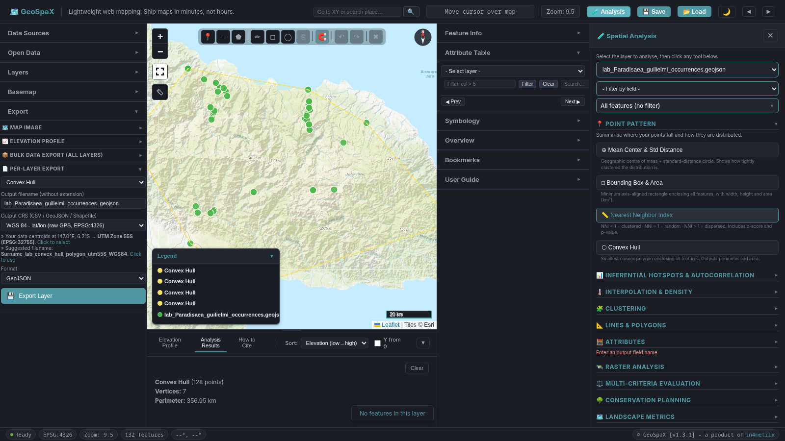**
>
> **Figure 10.** Species points labelled with site codes using the label popover (tag icon on the layer row).

### Step 3: Style the hull

1. Click the **Convex Hull** layer in the Layers panel.
2. In the **Symbology** panel (right side), set the fill opacity to 0% (transparent) and the stroke colour to a visible colour (e.g., dark red).
3. Set stroke width to 1.5 to 2 px so the hull boundary is clear on the map.

> ****
>
> **Figure 11.** Convex hull styled with transparent fill and a visible stroke colour in the Symbology panel.

### Step 4: Open the Map Composer

#### Understanding this tool: Map Composer

**What it does:** The Map Composer (also called "Print Layout" in QGIS or "Layout View" in ArcGIS) takes your interactive map and arranges it on a printable page. It adds **map furniture** - title, legend, scale bar, north arrow, CRS text, and source line - and exports the result as a PNG or PDF at a chosen DPI. The composer freezes the current map view: what you see is what gets exported.

**Why this assignment uses it:** A screenshot of the map is not a map. A map must have a title, legend explaining the symbols, a scale bar showing distance, a north arrow showing orientation, the CRS, and a source line crediting the data. These elements are required by the assignment rubric and are standard in all published maps. The composer ensures every map you submit has all required elements in a consistent layout.

**What it means in real-world conservation:** Every conservation plan submitted to a government agency, funding body, or community meeting includes formatted maps with these same elements. A map without a scale bar is useless for field planning - the reader cannot judge distances. A map without a source line is not citable. A map without a legend is not interpretable. The Map Composer teaches the professional habit of producing publication-ready maps, not screenshots.

1. In the **left panel**, expand the **Export** section, then expand the **🗺️ Map Image** subsection. Click **🖼️ Export as PNG** or **📄 Export as PDF**.
2. A floating **Export Map** dialog appears with options for DPI, map extent, and legend.
3. Click **Preview** to open the Map Composer. The composer opens as a modal overlay showing your map with furniture elements.
3. Set the paper size to **A4 Landscape** (or as directed).

> **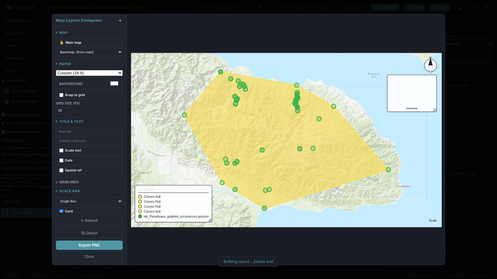**
>
> **Figure 12.** Map Composer opened from the Export section, showing the map canvas with default furniture elements.

### Step 5: Add the title

1. In the composer sidebar, find the **Title** input field.
2. Enter: `FR422 study area, [Your Species Common Name] ([Scientific Name])`
3. Example: `FR422 study area, Emperor Bird-of-paradise (Paradisaea guilielmi)`
4. Add a **Subtitle** with the source line: `GBIF PNG teaching extract, [access date], not a census`

> ****
>
> **Figure 13.** Map Composer with the title and subtitle added in the sidebar, displayed on the map layout.

### Step 6: Enable CRS text

1. In the composer sidebar, find the **Spatial ref** checkbox (under the map elements section).
2. Check the box. The CRS text (e.g., "EPSG:4326") appears in the bottom-right of the map.
3. Note: The CRS text shows the map's display CRS. Write your CRS (e.g., "CRS: EPSG:32755") in your title or subtitle to meet the assignment requirement.

### Step 7: Verify map elements

Check that the following are visible on the composer:

- **Points** with site labels
- **Convex hull** boundary
- **Legend** (showing both the points and hull layers)
- **Scale bar** (bottom area of the map)
- **North arrow** (top-right of the map)
- **Title** and **subtitle** (top of the map)
- **CRS text** (bottom-right)

If any element is hidden, toggle it on in the composer sidebar.

### Step 8: Export the map

1. In the composer, click **Export PNG** or **Export PDF**.
2. Set DPI to **300** for the final version.
3. Save as `Surname_lab_map1_study_area.pdf`.

> **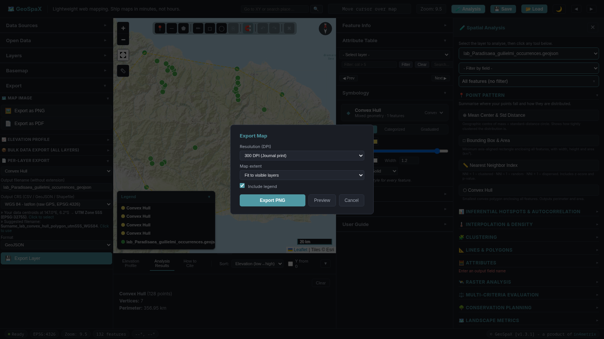**
>
> **Figure 14.** Export dialog in the Map Composer, showing DPI and format options for the final map output.

---

## Map 2: Attribute Map (Graduated)

**Required:** Graduated classes of `tree_cover_pct` (or `elevation_m`), legend, same extent, CRS, source line.
**File name:** `Surname_lab_map2_attribute.pdf`

### Understanding this tool: Graduated Symbology

**What it does:** Graduated symbology divides a numeric attribute (like tree cover percentage) into a set of classes (e.g., 0-20%, 20-40%, 40-60%, 60-80%, 80-100%) and assigns a colour to each class. Every point is coloured according to which class its value falls into. This is the same as "Graduated" in QGIS or "Quantities - Graduated colors" in ArcGIS.

**Why this assignment uses it:** Your species file contains environmental attributes sampled at each GBIF occurrence point. By graduating tree cover (or elevation), you can see whether your species occurs across a wide range of conditions or is restricted to a narrow band. This visual gradient is the first step in understanding habitat requirements. The class breaks you record are evidence for your report: "My species occurs at sites with 40-80% tree cover, with 65% of records in the 60-80% class."

**What it means in real-world conservation:** Graduated maps are the standard communication tool for presenting environmental data to stakeholders, park managers, and funding bodies. In a real conservation plan, a graduated tree-cover map might be used to identify which parts of a proposed protected area are still well-forested (high priority for protection) versus which parts have been degraded (priority for restoration). The choice of classification method (equal interval, quantile, natural breaks) and number of classes affects the message - in this assignment you use equal intervals for simplicity, but in a real plan you would justify your classification method.

### Step 1: Select the layer and switch to Graduated

1. In the **Layers** panel, click your species layer name to select it.
2. In the **Symbology** panel (right side), click the **Graduated** tab (next to "Single Symbol" and "Categorized").

> ****
>
> **Figure 15.** Symbology panel switched to the Graduated tab, showing the field, classes, and colour ramp controls.

### Step 2: Set the field and classes

1. Set the **Field** dropdown to `tree_cover_pct` (or `elevation_m` if you justify it in your report).
2. Set **Classes** to **5** (type the number in the classes input).
3. Choose a **Colour ramp**: Viridis (default), Heat, Cool, or Terrain.
4. Click the **Apply** button.
5. The map now shows points coloured by the selected attribute.

### Step 3: Record the class breaks

1. Look at the **legend** on the map (bottom-right area). It now shows a colour ramp with break values.
2. **Write down the class break values** in your notebook.
3. Example: 0 to 20%, 20 to 40%, 40 to 60%, 60 to 80%, 80 to 100%.
4. You will state the number of classes and the break values in your report.

### Step 4: Open the composer and export

1. Open the **Composer**: in the **left panel**, expand **Export** → **🗺️ Map Image**, click **🖼️ Export as PNG** or **📄 Export as PDF**, then click **Preview**.
2. Set the title to: `Attribute map: tree cover (%) - [Your Species Name]`
3. Set the subtitle (source line): `GBIF PNG teaching extract, [access date], not a census`
4. Verify the legend shows the graduated classes with break values.
5. Export as `Surname_lab_map2_attribute.pdf` at 300 DPI.

---

## Map 3: Spatial Pattern (Getis-Ord Gi* or LISA)

**Required:** Gi* or LISA on `tree_cover_pct`, legend with significance classes, CRS, source line.
**File name:** `Surname_lab_map3_pattern.pdf`
**Tool:** GeoSpaX (this map must be done in GeoSpaX)

### Understanding this tool: Getis-Ord Gi* and LISA

**What it does:** Getis-Ord Gi* (pronounced "gee-eye-star") is a **local spatial autocorrelation** statistic. For each point, it looks at the values of neighbouring points (within a distance band or k nearest neighbours) and asks: "Is this point surrounded by similarly high or similarly low values?" If the answer is yes with statistical confidence, the point is labelled a **hot spot** (cluster of high values) or **cold spot** (cluster of low values). The significance levels (99%, 95%, 90%) tell you how confident the clustering is.

LISA (Local Indicators of Spatial Association, based on Local Moran's I) does something similar but also identifies **outliers** - a high value surrounded by low values (HL) or a low value surrounded by high values (LH). GeoSpaX uses 999 random permutations to compute significance for LISA.

**Why this assignment uses it:** Tree cover at individual GBIF points does not tell you whether high-quality forest is concentrated in one area or scattered randomly. Gi* answers that question. A cluster of 99% hot spots means there is a statistically significant concentration of high tree-cover sites - a forest block worth protecting. A cluster of cold spots means degraded or open areas. This spatial structure is invisible in Map 2 (which shows individual point values) and only emerges from the neighbourhood analysis.

**What it means in real-world conservation:** Hot spot analysis is widely used in conservation planning to identify **priority clusters** - areas where high-quality habitat is concentrated. A 99% hot spot on tree cover is strong evidence that a forest block exists and is worth protecting. Cold spots may indicate areas where habitat has been lost and restoration is needed. In a real conservation plan, you would use the hot-spot map to justify why a specific cluster of sites should be prioritised over isolated individual sites. The FDR (False Discovery Rate) correction is standard practice in spatial statistics - it prevents you from over-counting significant spots when you are testing many points at once.

**What it is NOT:** Gi* does not predict where the species will occur. It does not model habitat suitability. It only identifies spatial clustering in the values of one variable at the points you already have. If your points are sparse (fewer than 30 records or 30 unique sites), the results are exploratory, not definitive.

### Step 1: Set the analysis variable

1. Open the **Analysis** drawer (click the 🧪 **Analysis** button in the toolbar - the drawer opens on the right side, next to the Feature Info panel).
2. Select your species layer from the **Layer** dropdown at the top.
3. Find the **Analysis variable** dropdown (in the settings area above the tool buttons).
4. Set it to `tree_cover_pct`.

> **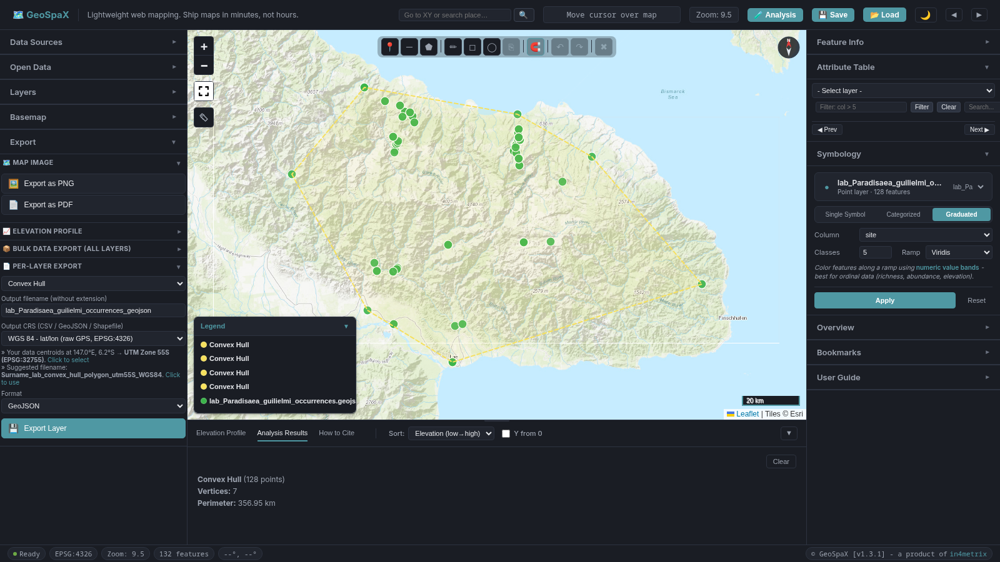**
>
> **Figure 16.** Analysis drawer showing the analysis variable dropdown set to tree_cover_pct for hot-spot analysis.

### Step 2: Set spatial weights

1. Find the **Weights type** dropdown (next to the analysis variable).
2. Choose either:
   - **Distance band** (auto-computed. The results will show the band distance, e.g., "53.87 km"), or
   - **K-nearest neighbours** with k = 8 (default. Change the **Neighbours (k)** input if needed).
3. Leave **Apply FDR correction** (Benjamini-Hochberg) **checked**. Write in your report that FDR was applied.

### Step 3: Run Getis-Ord Gi*

1. Find the **📊 Inferential Hotspots & Autocorrelation** section.
2. Click the **🔥 Getis-Ord Gi* Hot Spots** button.
3. Wait a few seconds for the analysis to complete.

### Step 4: Read the results

1. The **Analysis Results** panel (bottom panel, **Analysis Results** tab) shows:
   - **Attribute:** tree_cover_pct
   - **Hot 99%:** count (deep red points)
   - **Hot 95%:** count (red points)
   - **Hot 90%:** count (orange points)
   - **Cold 99%:** count (dark blue points)
   - **Cold 95%:** count (blue points)
   - **Cold 90%:** count (light blue points)
   - **Not significant:** count (grey points)
   - **Weights:** distance band = X km, UTM 55S (or KNN k=8)
   - **FDR note:** "False Discovery Rate (Benjamini-Hochberg) correction applied."
2. **Record all class counts** from the results panel.
3. **State the row count and unique-site count** of your file in the map caption. If either is below 30, write that Map 3 is exploratory.
4. If you ran Gi* on every row, write that stacked coordinates are present.

> **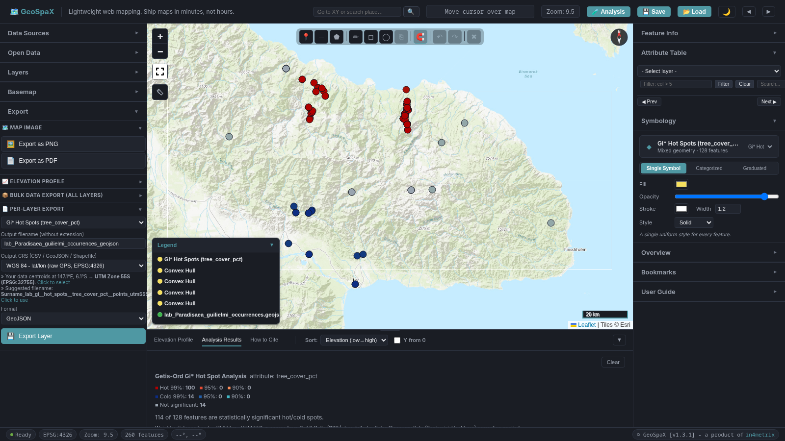**
>
> **Figure 17.** Getis-Ord Gi* results displayed on the map and in the Analysis Results panel, showing hot spots (red) and cold spots (blue) by significance level.
>
> **Training file example:** With the *P. guilielmi* training file (128 records), the Gi* results show 100 hot spots at 99% and 14 cold spots at 99%, with 14 not significant. The distance band was 53.87 km in UTM 55S.

### Alternative: Run LISA instead

If you prefer Local Moran's I (LISA):

1. Click the **🗺️ LISA Cluster & Outlier Map** button (next to the Gi* button, in the **📊 Inferential Hotspots & Autocorrelation** section).
2. Same field (`tree_cover_pct`), same weights choice.
3. The legend shows HH (High-High), LL (Low-Low), HL (High-Low outlier), LH (Low-High outlier), and Not significant.
4. GeoSpaX uses 999 permutations. Write that number in your report.

> **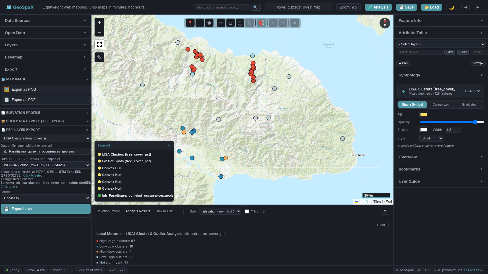**
>
> **Figure 18.** LISA cluster map showing High-High, Low-Low, and outlier classes with 999-permutation significance.

### Step 5: Open the composer and export

1. Open the **Composer**: in the **left panel**, expand **Export** → **🗺️ Map Image**, click **🖼️ Export as PNG** or **📄 Export as PDF**, then click **Preview**.
2. Set the title to: `Spatial pattern: Gi* on tree cover - [Your Species Name]`
3. Set the subtitle (source line): `GBIF PNG teaching extract, [access date], not a census`
4. Verify the legend shows the Gi* significance classes (or LISA cluster types).
5. Export as `Surname_lab_map3_pattern.pdf` at 300 DPI.

> ****
>
> **Figure 19.** Completed Map 3 in the Map Composer, showing Gi* significance classes with legend, scale bar, north arrow, and CRS text.

---

## Map 4: Habitat Proxy Score

**Required:** A `habitat_score` field calculated from at least three attributes (`elevation_m`, `tree_cover_pct`, `rainfall_mm`), with thresholds and weights justified by literature for your approved species. Graduated styling. Not a species distribution model.
**File name:** `Surname_lab_map4_habitat_proxy.pdf`
**Tool:** GeoSpaX Calculate Field tool

### Understanding this tool: Calculate Field (Weighted Conditions)

**What it does:** The Calculate Field tool creates a new attribute by combining existing fields using rules you define. In **Weighted conditions** mode, each row tests one field against a threshold (e.g., `elevation_m between 0 and 2000`, `tree_cover_pct >= 50`), and each test contributes a weight to the final score. A point that passes all three tests gets a score of 3 (for equal weights of 1 each); a point that passes none gets 0.

**Why this assignment uses it:** No single environmental variable defines habitat quality for a forest species. A site at the right elevation but with no tree cover is not good habitat. A site with 90% tree cover but at sea level (wrong elevation band) is not good habitat either. The habitat score combines multiple criteria into a single ranking that reflects the species' overall requirements. The thresholds and weights must come from published literature on your species - this forces you to research the species before touching the software.

**What it means in real-world conservation:** This is a simplified version of **Multi-Criteria Evaluation (MCE)**, also called Weighted Linear Combination (WLC) - one of the most widely used methods in conservation planning and land-use suitability analysis. Real-world tools like Marxan, the GeoMOD module in QGIS, or ArcGIS's Weighted Overlay tool do the same thing at a more sophisticated level: they combine multiple spatial criteria with weights to produce a suitability or priority surface. The principle is identical: (1) identify the criteria that matter for your species, (2) set thresholds from literature or expert knowledge, (3) assign weights reflecting the relative importance of each criterion, (4) combine into a single score.

**What it is NOT:** The habitat score is not a species distribution model (SDM). It does not use presence-absence modelling, MaxEnt, or machine learning. It does not predict where the species could occur - it only ranks the sites where the species has already been recorded. The title must say "habitat proxy", not "distribution model" or "suitability". This distinction matters because an SDM extrapolates beyond known sites, while a habitat proxy only scores known sites.

### Step 1: Prepare your thresholds

Before touching the software, write down:

1. The **elevation band** for your species (from literature). Example: 500 to 1800 m.
2. The **tree cover threshold** for your species. Example: >= 70%.
3. The **rainfall threshold** for your species. Example: >= 2500 mm.
4. The **weight** for each criterion. Example: 1, 1, 1 (equal weights) or 2, 1, 1.
5. The **citations** for each threshold.

### Step 2: Open Calculate Field

1. Open the **Analysis** drawer (click the 🧪 **Analysis** button in the toolbar - the drawer opens on the right side, next to the Feature Info panel).
2. Select your species layer from the **Layer** dropdown at the top.
3. Scroll down to the **🧮 Attributes** section.
4. If the section is collapsed, click the **Attributes** header to expand it.

> ****
>
> **Figure 20.** Calculate Field section in the Analysis drawer, showing the Weighted conditions mode with three empty criterion rows.

### Step 3: Set the output field name

1. In the **Output field name** input, type: `habitat_score`
2. Set **Output type** to **Integer**.

### Step 4: Add your three criteria (Weighted conditions mode)

The Calculate Field tool opens in **Weighted conditions** mode by default, with 3 empty rows. Fill in three rows (one per criterion):

**Table 6.** Example Calculate Field criteria for three weighted conditions (elevation, tree cover, rainfall).

| Row | Field | Test | Value | Max (if between) | Weight |
| --- | --- | --- | --- | --- | --- |
| 1 | `elevation_m` | between | [low] | [high] | [weight] |
| 2 | `tree_cover_pct` | >= | [percent] | - | [weight] |
| 3 | `rainfall_mm` | >= | [millimetres] | - | [weight] |

For each row:

1. Click the **Field** dropdown and select the field name.
2. Click the **Test** dropdown and select the operator (`between`, `>=`, `>`, `<=`, `<`, `=`, `!=`).
3. If you chose `between`, two input boxes appear: **min** and **max**. Fill both.
4. For other tests, fill the **value** input box.
5. Set the **Weight** (the × column) to your chosen weight (default is 1).

Example for a species favouring mid-elevation forest with high rainfall:

**Table 7.** Example Calculate Field criteria for a species favouring mid-elevation forest with high rainfall.

| Row | Field | Test | Value | Max | Weight |
| --- | --- | --- | --- | --- | --- |
| 1 | `elevation_m` | between | 0 | 2000 | 1 |
| 2 | `tree_cover_pct` | >= | 50 | - | 1 |
| 3 | `rainfall_mm` | >= | 2500 | - | 1 |

### Step 5: Preview and run

1. The **live preview** (below the rows) shows the first 5 features with old value to new value.
2. Check that the preview values make sense (scores should be 0, 1, 2, or 3 for equal weights).
3. Click the **🧮 Calculate field** button.
4. The **Analysis Results** panel (bottom panel, **Analysis Results** tab) shows:
   - **Layer:** your species layer name
   - **Output field:** habitat_score
   - **Features written:** 128 (or your count)
   - **Null outputs:** 0
   - **Min:** 0, **Max:** 3, **Mean:** (e.g., 2.742)
   - **Layer styled graduated on habitat_score**
   - The **exact expression** used, e.g.:
     `(elevation_m >= 0 && elevation_m <= 2000 ? 1 : 0) + (tree_cover_pct >= 50 ? 1 : 0) + (rainfall_mm >= 2500 ? 1 : 0)`
5. **Copy the expression** from the results panel. Paste it into your report methods section.

> ****
>
> **Figure 21.** Calculate Field live preview showing the first five features with old and new habitat_score values before running the calculation.
>
> ****
>
> **Figure 22.** Calculate Field results in the Analysis Results panel, showing feature count, min/max/mean, and the exact expression used.

### Step 6: Verify the habitat_score field

1. Open the **Attribute Table** (right panel).
2. Select your species layer from the dropdown.
3. Scroll right in the table. You should see a new **`habitat_score`** column.
4. Confirm the values are whole numbers (0, 1, 2, or 3 for three equal-weight criteria).

> **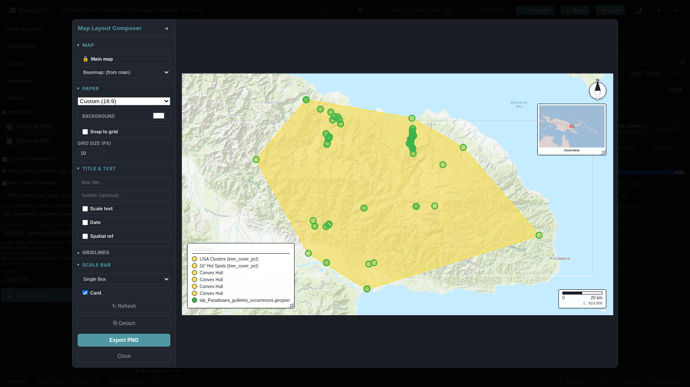**
>
> **Figure 23.** Attribute Table with the new habitat_score column visible, showing integer scores (0-3) for each occurrence record.

### Step 7: Style the habitat_score

1. The Calculate Field tool automatically applies **Graduated** styling to the new field.
2. If you want to adjust: select your species layer in the Layers panel, go to **Symbology, then Graduated**, and confirm the field is `habitat_score`.
3. Set 4 or 5 classes (e.g., 0, 1, 2, 3 for three equal-weight criteria).
4. Choose a colour ramp (e.g., Green to Yellow to Red, or Viridis).
5. Click **Apply**.

### Step 8: Open the composer and export

1. Open the **Composer**: in the **left panel**, expand **Export** → **🗺️ Map Image**, click **🖼️ Export as PNG** or **📄 Export as PDF**, then click **Preview**.
2. Set the title to: `Habitat proxy of GBIF points - [Your Species Name]`
3. **Important:** The title must say "habitat proxy of GBIF points", NOT "species distribution" or "habitat suitability".
4. Set the subtitle (source line): `GBIF PNG teaching extract, [access date], not a census`
5. Verify the legend shows the habitat_score classes.
6. Export as `Surname_lab_map4_habitat_proxy.pdf` at 300 DPI.

> **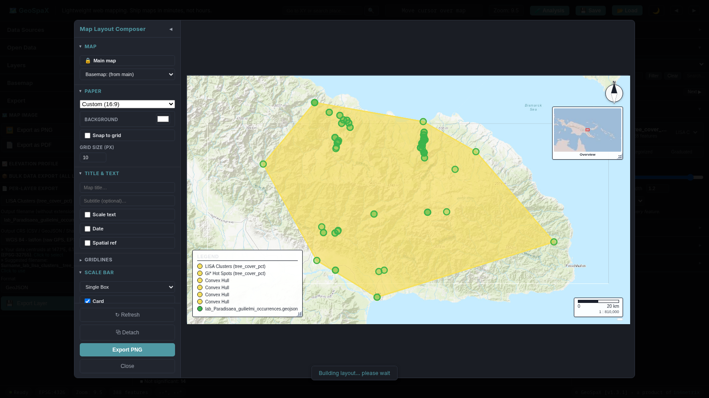**
>
> **Figure 24.** Completed Map 4 in the Map Composer, showing graduated habitat_score classes with legend, scale bar, north arrow, and CRS text.

---

## Systematic Conservation Planning: Why We Work at the Hull Scale

### The problem with country-wide planning

Planning conservation for an entire country is expensive, logistically complex, and often ineffective. A national map cannot tell you where a specific species actually occurs, which forests are under threat, or which sites are already protected. Systematic conservation planning (SCP) - the standard approach used worldwide since Margules & Pressey (2000) - does not start with a country outline and draw boxes on it. It starts with biodiversity data and works outward.

**Real-world example:** Papua New Guinea has over 5% of the world's biodiversity in less than 1% of its land area. A country-wide conservation plan for PNG would need to cover over 460,000 km², involve 22 provinces, hundreds of clan landowners, and dozens of languages. No single organisation has the resources to plan at that scale. Instead, real conservation in PNG happens at the scale of a single species' range, a single forest block, or a single watershed - exactly the scale your hull represents. Organisations like the Wildlife Conservation Society in PNG work at the scale of individual landscapes (e.g., the Huon Peninsula, the Torricelli Mountains), not the whole country.

### The five key stages of SCP (simplified)

The full SCP framework (Pressey & Bottrill, 2009) has 11 stages. For this assignment, we use a simplified five-stage version that maps directly onto your four maps:

**Table 8.** The five key stages of systematic conservation planning and how each maps onto the assignment.

| SCP Stage | What it means | Your assignment maps onto |
|-----------|---------------|--------------------------|
| **1. Collect biodiversity data** | Map where the species actually occurs | **Map 1**: GBIF occurrence points and convex hull define the study area |
| **2. Describe the environment** | Understand habitat conditions at occurrence sites | **Map 2**: Graduated tree cover / elevation shows the environmental gradient |
| **3. Identify spatial patterns** | Find clusters of high-quality or low-quality habitat | **Map 3**: Gi* / LISA hot spots and cold spots reveal spatial structure |
| **4. Score habitat quality** | Rank sites by suitability for the target species | **Map 4**: Habitat proxy score combines elevation, tree cover, and rainfall |
| **5. Gap analysis & prioritisation** | Compare habitat with existing protection; identify unprotected priority sites | **Step 5 below**: Load protected areas, run Protection Gap, identify priority areas |

**How this maps to real-world SCP:** In a full SCP exercise (e.g., the Marxan-based planning used for the Great Barrier Reef Marine Park rezoning in 2004), stages 1-4 are the data preparation phase. Stage 5 is where the actual prioritisation happens - software like Marxan runs thousands of iterations to find the most efficient set of sites that meets conservation targets at the lowest cost. Your assignment does a simplified version: you manually score habitat (Map 4), then manually identify gaps (Step 5). The logic is the same; the automation is different.

### Why the hull is your planning region

Your convex hull (Map 1) is not just a drawing exercise - it defines the **planning region** in the SCP sense. The hull is the area where your species actually occurs, based on real GBIF records. This is far smaller and more actionable than a national boundary. A conservation plan for a 50 km × 40 km hull where your species lives is practical; a plan for all of PNG is not.

**Real-world parallel:** When the IUCN Red List assesses a species, it maps the species' **extent of occurrence** (similar to your hull) and **area of occupancy** (the actual sites where the species is found). These two metrics determine the species' threat category. Your hull is the equivalent of extent of occurrence - it defines the planning boundary. Your individual GBIF points are the equivalent of area of occupancy - they define where the species actually is within that boundary.

**Key SCP principles to mention in your report:**

- **Representation**: Your conservation actions should cover the range of environmental conditions where the species occurs (different elevations, tree-cover levels, rainfall zones). Maps 2 and 4 show this range. In real-world SCP, representation targets are quantitative (e.g., "protect at least 30% of each forest type") - the Kunming-Montreal Global Biodiversity Framework (2022) adopted the "30 by 30" target, aiming to protect 30% of land and sea by 2030.
- **Complementarity**: Each proposed conservation action should add something the others do not. If you propose two actions, they should protect different habitat types or different hot-spot clusters, not the same area twice. This is the core principle that distinguishes SCP from ad-hoc conservation - it asks "what does this site add that the other sites do not?"
- **Efficiency**: Focus on the smallest area that achieves the most protection. The hot-spot map (Map 3) shows where high-quality habitat is concentrated - protecting those areas is more efficient than protecting random sites. In real-world SCP, efficiency is measured as the cost of achieving targets - Marxan minimises a cost function while meeting representation targets.
- **Irreplaceability**: Some sites cannot be replaced - if your species only occurs in one high-elevation forest patch, that patch is irreplaceable. Your habitat score (Map 4) and hot-spot analysis (Map 3) help identify these sites. In real-world SCP, irreplaceability is computed as the proportion of solutions in which a site is selected - a site that appears in 100% of Marxan runs is fully irreplaceable.

### Reference

- Margules, C.R. & Pressey, R.L. (2000). Systematic conservation planning. *Nature*, 405, 243-253.
- Pressey, R.L. & Bottrill, M.C. (2009). Systematic conservation planning. In *Encyclopedia of Life Sciences*. Wiley.
- CBD (2022). Kunming-Montreal Global Biodiversity Framework. Convention on Biological Diversity, Montreal.

---

## Step 5 (Optional but Recommended): Conservation Gap Analysis

This step is optional for the four required maps but strongly recommended for Part B (the conservation plan). It uses the shared protected-areas layer to check whether your species' high-quality habitat is already protected or falls in a gap.

### Understanding these tools: Protection Gap and Priority Area Identification

**What the Protection Gap tool does:** It overlays your habitat layer (Layer A) with a protected-areas layer (Layer B) and computes how much of your habitat falls inside versus outside existing protected areas. The result is a gap percentage: the proportion of your species' habitat that is NOT currently protected. It also names the specific protected areas that overlap your habitat.

**What the Priority Area Identification tool does:** It takes your species points (which have a `habitat_score` from Map 4), checks each point against the protected-areas layer, and identifies points that are both **high-quality** (score above your threshold) AND **unprotected** (outside any PA polygon). These are the sites where new conservation action would have the highest return - they are good habitat that is currently not safeguarded.

**Why this assignment uses them:** The four maps (1-4) tell you where your species occurs, what the environment looks like, where habitat clusters, and which sites score highest. But they do not tell you whether any of this habitat is already protected. Without gap analysis, a conservation plan might propose protecting an area that is already a national park. The gap analysis closes this loop: it connects your habitat assessment to the existing protected-area network and identifies the actual gaps that need filling.

**What it means in real-world conservation:** Gap analysis is a core step in systematic conservation planning and is required reporting under the Convention on Biological Diversity (CBD). The World Database on Protected Areas (WDPA) is the global standard - every country reports its protected areas to it. When a real conservation organisation like WWF or WCS plans a new protected area, the first question is: "What is already protected, and what is missing?" The gap analysis answers this. The Priority Area Identification tool is a simplified version of what Marxan does - Marxan uses optimisation algorithms to find the most efficient set of new sites to fill gaps, while our tool simply identifies which high-quality sites are unprotected. The principle is the same: focus new protection where it fills a real gap, not where protection already exists.

**What the gap percentage is NOT:** The gap percentage tells you what proportion of YOUR species' hull extent is protected, not what proportion of PNG is protected. Do not generalise it to a national figure. It is also not a measure of management effectiveness - a site may be "protected" on paper but poorly managed in practice.

### What you need

- Your species layer with `habitat_score` (from Map 4)
- The shared `PNG_protected_areas.gpkg` file from `FR422_SHARED_DATA_2026.zip`

### Step 1: Load the protected areas layer

1. In GeoSpaX, open **Data Sources** in the left panel and load `PNG_protected_areas.gpkg` from the `PROTECTED_AREAS` folder.
2. A new layer appears showing protected-area polygons. Note the layer name (e.g., `PNG_protected_areas`).
3. Cite the source in your provenance table: *World Database on Protected Areas (WDPA), UNEP-WCMC, accessed via the PNG Environment Data Portal / SPREP mirror. See `SHARED_DATA_SOURCES.txt` for full citation.*

### Step 2: Run the Protection Gap tool

1. Open the **Analysis** drawer (click the 🧪 **Analysis** button in the toolbar - the drawer opens on the right side, next to the Feature Info panel).
2. Scroll to the **🌳 Conservation Planning** section.
3. In the **Protection Gap** subsection, the tool uses Layer A and Layer B from the top of the Analysis drawer.
4. Set **Layer A** to your species layer (or your convex hull layer - the hull is the planning region).
5. Set **Layer B** to the protected-areas layer.
6. Click **Run Protection Gap**.
7. The results panel shows:
   - **Total habitat area:** the area of your hull (or species points' extent) in hectares
   - **Protected area:** how much of your habitat is inside existing protected areas
   - **Gap area:** how much of your habitat is NOT inside any protected area
   - **Gap percentage:** the percentage of your habitat that is unprotected

> **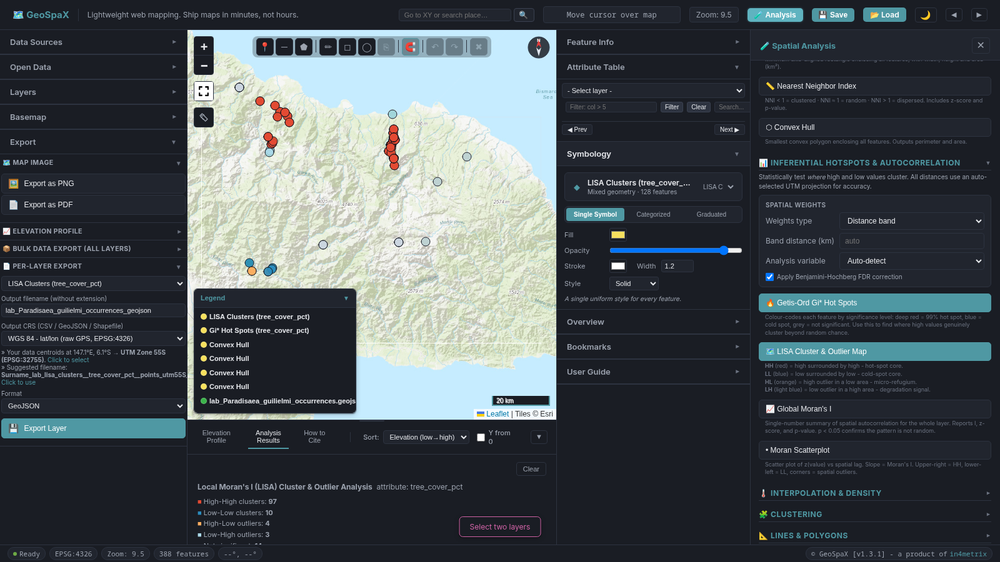**
>
> **Figure 25.** Protection Gap analysis results showing total habitat area, protected area, gap area, and gap percentage for the training file.
>
> *Example result (training file): Total habitat area 807,358 ha, inside protected areas 59,918 ha, gap 747,437 ha, protected proportion 7.4%, protected areas intersected: Nusareng and YUS.*

### Step 3: Interpret the gap

1. **If the gap is large (e.g., > 70%):** Most of your species' habitat is unprotected. Your conservation plan should prioritise the unprotected high-quality areas.
2. **If the gap is small (e.g., < 30%):** Much of the habitat is already inside protected areas. Your plan should focus on maintaining and monitoring existing protection, and filling the remaining gaps.
3. **If the gap is 100%:** None of your species' habitat is currently protected. Your entire plan is about new protection.
4. **Write the gap percentage in your report** with the citation. State that this is the gap between your hull extent and the WDPA layer, not a national assessment.

### Step 4: Identify priority conservation areas

Use the **Priority Area Identification** tool to find sites that are both high-quality habitat AND unprotected:

1. In the **🌳 Conservation Planning** section, find the **Priority Area Identification** subsection.
2. Set **Habitat layer** to your species layer (the one with `habitat_score`).
3. Set **Protected areas layer** to the protected-areas layer.
4. Set **Score field** to `habitat_score` (this is the default).
5. Set **Minimum habitat score** to the threshold you want (e.g., 2 out of 3, meaning sites meeting at least 2 of your 3 criteria).
6. Click **Identify Priority Areas**.
7. The tool creates a new layer showing points that are:
   - High habitat quality (score >= your threshold), AND
   - Outside existing protected areas (the gap)
8. These are your **priority conservation areas** - the sites most in need of new protection.

> ****
>
> **Figure 26.** Priority Area Identification results showing high-quality, unprotected sites as a new layer on the map.
>
> *Example result (training file): 128 total points, 111 priority (high-quality & unprotected), 12 already protected, 5 below score threshold of 2.*

### Step 5: Use the results in your conservation plan

In Part B of your report:

1. **State the gap percentage** and cite the WDPA source.
2. **Name the priority areas** by their site codes or geographic description (e.g., "the high-elevation forest cluster in Western Province, sites GBIF_6195567946 and GBIF_6179346071, which have habitat scores of 3 but fall outside the existing protected-area network").
3. **Propose two or three spatially explicit actions** for these priority areas, using the legal instruments from the assignment brief.
4. **Explain how your plan follows SCP principles**: representation (covering different habitat types), complementarity (each action adds something new), and efficiency (focusing on the smallest area with the highest return).

> **Important:** The gap analysis uses your hull extent, not the national boundary. It tells you what proportion of YOUR species' habitat is protected, not what proportion of PNG is protected. Do not generalise it to a national figure.

---

## After All Four Maps

### Export your data

1. Open the **Export** panel.
2. Set **Output CRS** to the UTM zone shown by the auto-detect hint (or manually select the correct zone for your data - see the export section above).
3. Export your species layer as **GeoJSON** (`Surname_lab_species_points_utmXXS_WGS84.geojson`). **Replace `Surname` with your actual surname.**
4. Export your species layer as **CSV** (`Surname_lab_species_points_utmXXS_WGS84.csv`) if needed.
5. Export your Convex Hull layer as **GeoJSON** (`Surname_lab_species_hull.geojson`).
6. Export your Gi*/LISA layer as **GeoJSON** (`Surname_lab_species_pattern.geojson`).

### Save the project

1. Click the **💾 Save** button in the topbar.
2. A dialog appears with a filename input pre-filled with `project_geospax.gspx`. Edit the name to `Surname_lab.gspx`.
3. Click **Save**.
4. In Chrome or Edge, the browser's native Save As dialog opens so you can choose where to save the file. In Firefox, the file is saved to your Downloads folder.
5. This saves all layers, symbology, digitized features, bookmarks, and analysis results as a `.gspx` file.

> ****
>
> **Figure 27.** Save Workspace dialog with the filename field pre-filled, ready to save the project as a .gspx file.

### Complete the provenance table

Fill in the provenance table with:

- **GeoSpaX version** (from the page footer)
- **Access date** (today's date)
- **Dataset:** GBIF PNG teaching extract, [Your Species Name]
- **File:** the `<Species>_occurrences.geojson` file the lecturer sent you via Google Drive
- **Shared data:** `FR422_SHARED_DATA_2026.zip` from Google Classroom (see `SHARED_DATA_SOURCES.txt` inside the ZIP for full citations)
- **Filters:** country=PG, hasCoordinate=true, hasGeospatialIssue=false
- **Environmental fields:** WorldClim 2.1 BIO1/BIO12/BIO15, elevation; FR422 tree-cover proxy from ESA WorldCover 2021 class 10
- **n = [your record count]** ([your unique-site count] unique sites). Not a census.
- **Analysis CRS:** Your correct UTM zone (EPSG:32754, 32755, or 32756)
- **Calculate field expression:** (paste from the results panel)

### Checklist before submission

- [ ] Map 1: `Surname_lab_map1_study_area.pdf`: hull, points, labels, legend, scale bar, north arrow, CRS, source line
- [ ] Map 2: `Surname_lab_map2_attribute.pdf`: graduated classes, legend, CRS, source line
- [ ] Map 3: `Surname_lab_map3_pattern.pdf`: Gi* or LISA classes, legend, CRS, source line
- [ ] Map 4: `Surname_lab_map4_habitat_proxy.pdf`: habitat_score classes, legend, CRS, source line, title says "habitat proxy"
- [ ] Provenance table with GeoSpaX version and access date
- [ ] Exported GeoJSON in the correct UTM zone (EPSG:32754, 32755, or 32756)
- [ ] Saved `.gspx` project file
- [ ] Three thresholds, three weights, and citations written in the report
- [ ] No forest-loss hectares, no protected-area percentage, no clan names unless from a cited source
- [ ] (Recommended) Gap analysis run with WDPA layer, gap percentage reported with citation
- [ ] (Recommended) Priority areas identified and named in the conservation plan

---

## Optional: Loading and Reclassifying Raster Data

The four required maps use environmental fields already embedded in your species GeoJSON, so you do not need to load rasters. However, if you want to produce a raster backdrop (e.g. a temperature or tree-cover surface) for context or for an extra map, follow these steps.

### Loading a GeoTIFF

1. Open the **Analysis drawer** (click **Analysis** in the top toolbar).
2. Expand the **Raster Analysis** section.
3. Click **Select GeoTIFF** and choose a `.tif` file (e.g. `PNG_BIO1_30s.tif` from the shared data package).
4. Enter a **Layer Name** (e.g. `BIO1 Temperature`).
5. Click **Load GeoTIFF**.

The raster appears on the map with a default colour ramp. Use the **Symbology** panel (right panel) to change the band, colour ramp, min/max, and switch between continuous and classified mode.

> **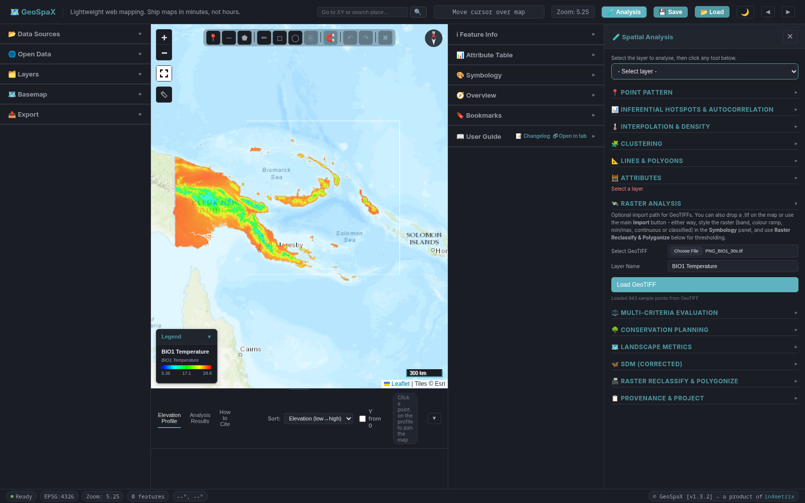**
>
> **Figure 28.** GeoTIFF raster (WorldClim BIO1 annual mean temperature) loaded and styled with a colour ramp on the map.
> A GeoTIFF (WorldClim BIO1 annual mean temperature) loaded and styled on the map.

### Reclassify and Polygonize

To convert a raster to vector polygons (e.g. identify all areas above a temperature threshold):

1. In the Analysis drawer, expand the **Raster Reclassify & Polygonize** section.
2. Select the **Raster layer** from the dropdown.
3. Set the **Band** (0 for single-band rasters).
4. Click **Histogram + Otsu** to view the value distribution and get an auto-suggested threshold.
5. Set the **Threshold** value and choose the comparison operator (>=, >, <=, <).
6. Tick **Merge into patches** to dissolve adjacent cells into single polygons.
7. Click **Reclassify & Polygonize**.

The output is a new vector polygon layer added to the Layers panel.

> **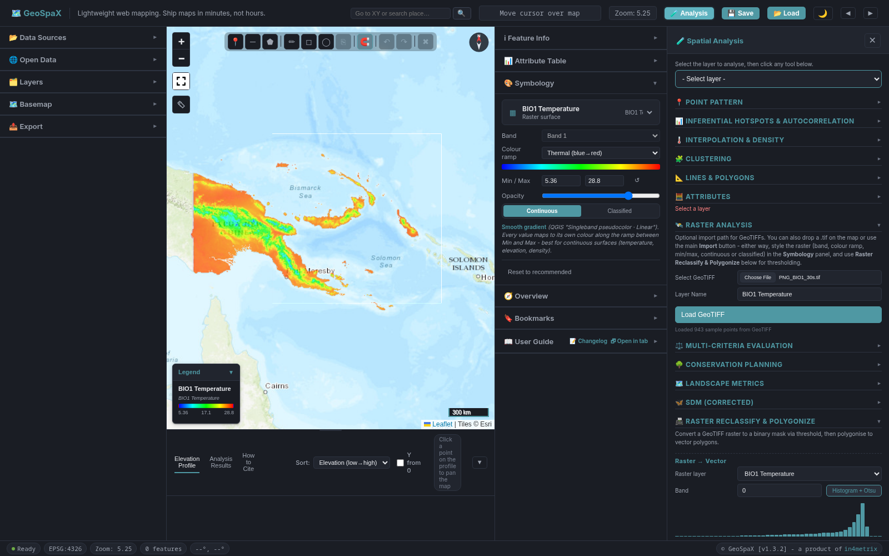**
>
> **Figure 29.** Raster Reclassify and Polygonize section showing the value distribution histogram with an Otsu-suggested threshold.
> Raster Reclassify section showing the histogram with Otsu threshold.

> ****
>
> **Figure 30.** Polygonized raster output: raster cells above the threshold converted to vector polygons and added as a new layer.
> Polygonized output: raster cells above the threshold converted to vector polygons.

---

## Quick Reference: GeoSpaX Tools Used

**Table 9.** Quick reference of GeoSpaX tools used for each map and their location in the interface.

| Map | Tool | Where in GeoSpaX |
| --- | --- | --- |
| Map 1 | Import, Convex Hull, Feature labels, Composer | Data Sources (left panel), 🧪 Analysis drawer → 📍 Point Pattern → ⬡ Convex Hull, Layers panel (left), Composer |
| Map 2 | Graduated symbology, Composer | 🎨 Symbology panel (right), Graduated tab, Composer |
| Map 3 | Getis-Ord Gi* (or LISA), Composer | 🧪 Analysis drawer → 📊 Inferential Hotspots & Autocorrelation → 🔥 Getis-Ord Gi* (or 🗺️ LISA), Composer |
| Map 4 | Calculate field, Graduated symbology, Composer | 🧪 Analysis drawer → 🧮 Attributes → 🧮 Calculate field, 🎨 Symbology panel (right), Composer |
| Step 5 (optional) | Protection Gap, Priority Area Identification | 🧪 Analysis drawer → 🌳 Conservation Planning → Run Protection Gap / Identify Priority Areas |

## Rules to Remember

1. **Use your issued file only.** Not the training file, not a classmate's file, not the built-in sample.
2. **One analysis CRS: your correct UTM zone** (EPSG:32754, 32755, or 32756 - use the auto-detect hint in the Export panel). Export your data to this CRS.
3. **Record the GeoSpaX version and access date** in your provenance table.
4. **Title Map 4 as "habitat proxy"**, not "distribution model" or "suitability".
5. **State your weights and thresholds** with citations in the report.
6. **If n or unique sites < 30, Map 3 is exploratory.** Say so in the caption.
7. **Do not report forest-loss hectares or protected-area percentages** unless you load a named layer and cite it.
8. **The convex hull area is not forest area.** Call it the hull area and quote the CRS.
9. **If your points span mainland and islands, choose one landmass.** Set the field filter to `stateProvince`, select the landmass with more points, and keep the filter on for all four maps. State your choice and the filtered point count in your report.
10. **Conservation planning is done at the hull scale, not the national scale.** Your hull is the planning region. The gap analysis tells you what proportion of YOUR species' habitat is protected, not what proportion of PNG is protected. Do not generalise it to a national figure.
11. **Follow SCP principles in your report.** State how your proposed actions achieve representation (covering different habitat types), complementarity (each action adds something new), and efficiency (smallest area, highest return).
