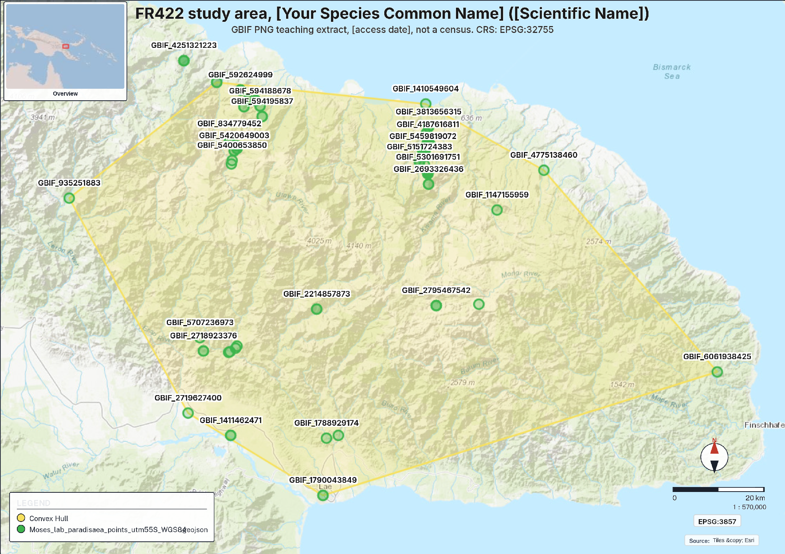
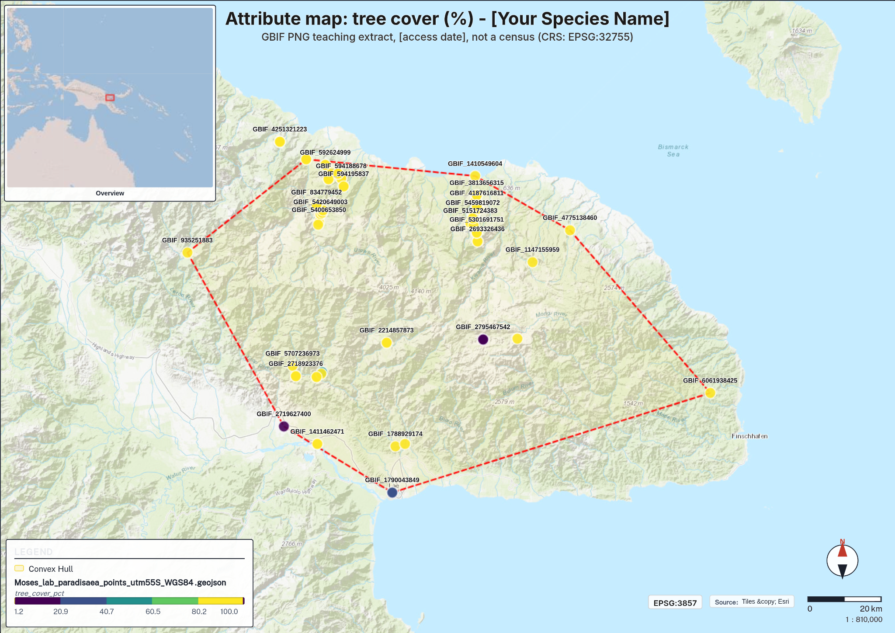
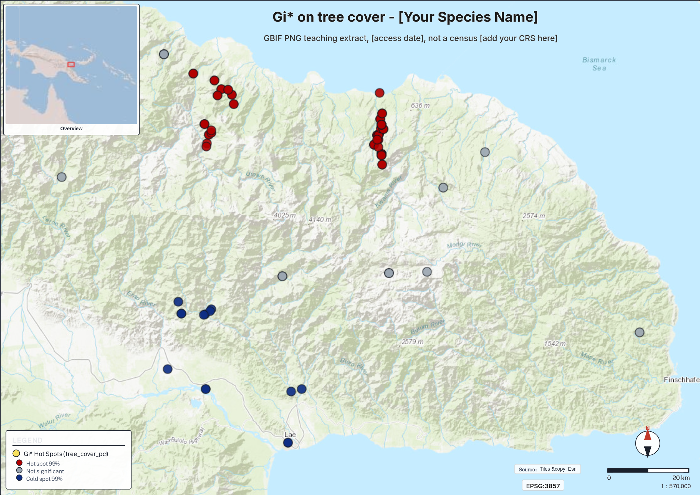
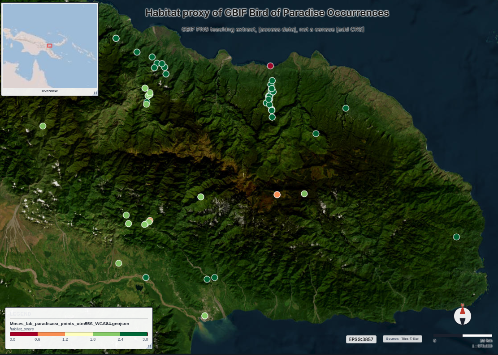
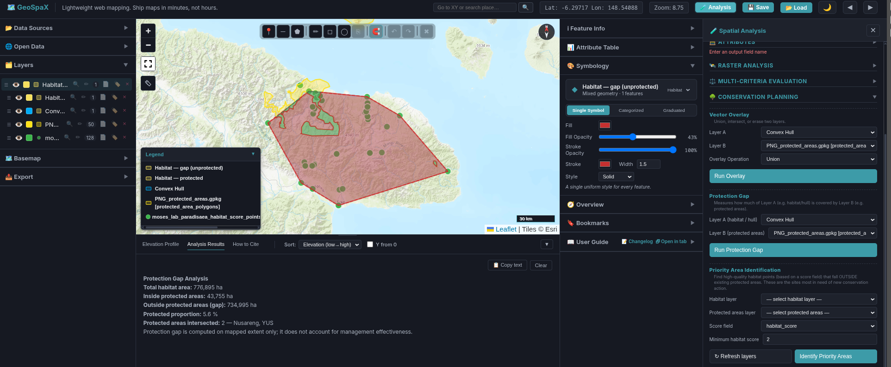
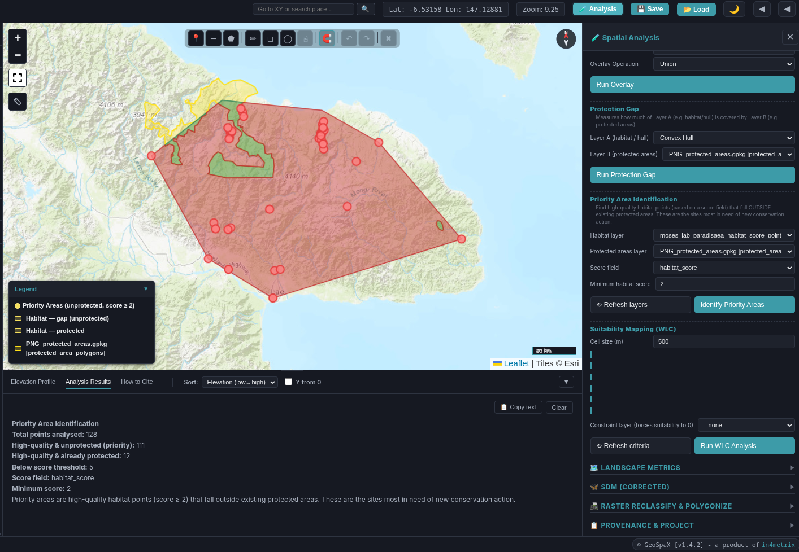

# Species Habitat Assessment and Conservation Plan — EXAMPLE REPORT

**FR422 · Forest Wildlife and Habitat · Semester 2, 2026**

> **EXAMPLE ONLY — MODEL ANSWER.** This report was prepared by the lecturer as a worked example using the Week 9 training species (Emperor Bird-of-paradise, *Paradisaea guilielmi*) and the training-file maps from the GeoSpaX step-by-step guide. **Do not submit this report.** Your Part B must use your own issued species, your own maps, your own thresholds, and your own citations. The structure, the depth, and the way each claim is tied to a map or a cited source are what you should copy.

**Species:** Emperor Bird-of-paradise, *Paradisaea guilielmi* (Cabanis, 1888)
**IUCN Red List category:** Near Threatened (BirdLife International, n.d.; accessed 15 September 2026)
**Student:** [Surname] **Date:** [submission date]

---

## 1. Introduction and species profile

The Emperor Bird-of-paradise is a sexually dimorphic bird-of-paradise endemic to the Huon Peninsula of Papua New Guinea, where it is recorded from the Saruwaged, Finisterre, Rawlinson and Cromwell Ranges (Australian Museum, n.d.). It occupies primary hill and lower montane forest, and also persists in pockets of forest within garden mosaics, over an elevational span of roughly 450–1,500 m, mainly 670–1,350 m (Australian Museum, n.d.). Its restricted range and dependence on intact forest are the reasons the IUCN lists it as Near Threatened (BirdLife International, n.d.).

The purpose of this plan is to convert the four maps produced in Part A, together with an optional protected-area gap analysis, into a prioritised, spatially explicit conservation plan for the species within its hull extent. The plan follows the simplified five-stage systematic conservation planning (SCP) framework of the GIS practical: collect biodiversity data, describe the environment, identify spatial pattern, score habitat quality, and compare habitat with existing protection (Margules & Pressey, 2000).

The plan works at the hull scale rather than the national scale for three reasons. First, the species is a Huon Peninsula endemic, so a national plan would allocate effort across four provinces where the species does not occur. Second, conservation in PNG operates through customary landowners and provincial authorities, both of which act at landscape scale, not national scale. Third, the SCP principle of efficiency asks for the smallest area that secures the most representation of the species' habitat (Margules & Pressey, 2000) — here, a single peninsula of hill forest rather than the whole of Morobe Province or PNG.

## 2. Methods

**Data.** The analysis used the issued species GeoJSON (128 records, 56 unique sites; GBIF teaching extract, 9 September 2026), imported into GeoSpaX v1.4.2 (accessed 15 September 2026). The file supplies elevation_m, tree_cover_pct and rainfall_mm sampled at each record, plus stateProvince. The training file is concentrated on the Huon Peninsula (Morobe Province), so no mainland–island subset was required.

**Analysis CRS.** The file is supplied in EPSG:4326, in which no area was calculated. The layer was exported to WGS 84 / UTM zone 55S (EPSG:32755) and all distance-based statistics were computed in that projected CRS.

**Map 1 (study area).** A convex hull of the filtered points was computed with the Convex Hull tool (7 vertices; perimeter 356.95 km). Site codes were labelled from the `site` field.

**Map 2 (attribute map).** tree_cover_pct was classified into five equal-interval graduated classes.

**Map 3 (spatial pattern).** Getis-Ord Gi* was run on tree_cover_pct with a distance-band weights matrix (auto-computed band 53.87 km) and the Benjamini–Hochberg false discovery rate (FDR) correction applied (Getis & Ord, 1992).

**Map 4 (habitat proxy).** A habitat_score field was calculated with the GeoSpaX Calculate Field tool (weighted conditions): elevation_m between 0 and 2,000 m (1 point), tree_cover_pct ≥ 50% (1 point), and rainfall_mm ≥ 2,500 mm (1 point), equal weights. This is a transparent rule-based proxy, not a species distribution model.

**Gap analysis (optional extra).** The shared WDPA layer (PNG_protected_areas.gpkg) was loaded and the Protection Gap and Priority Area Identification tools were run with the convex hull as the habitat layer and a minimum habitat score of 2.

## 3. Results: reading the four maps

**Study area (Figure 1).** The convex hull encloses the Morobe/Huon Peninsula cluster of records and defines the planning region for this assessment. The hull area (776,895 ha, EPSG:32755) is the area of the enclosing polygon only; it is not forest area and not the species' range.

**Environmental gradient (Figure 2).** Graduated classes of tree_cover_pct show that records span 1–100% tree cover, but the distribution is strongly skewed: 115 of 128 records have tree_cover_pct ≥ 90 (mean 92.6, median 98.5, minimum 0). The species is recorded almost exclusively in closed-canopy forest, with a small number of low-cover records marking garden-forest edges. Elevation in the file spans 15–2,664 m and rainfall 2,230–3,951 mm, so the recorded environment is consistently wet and mostly mid-elevation, matching the published habitat description of hill and lower montane forest (Australian Museum, n.d.). Because the environmental attributes are point samples, the map shows conditions at the record sites only, not a continuous surface.

**Spatial pattern (Figure 3).** The Gi* analysis (distance band 53.87 km, FDR-corrected) identified 100 hot spots at 99% confidence and 14 cold spots at 99% confidence, with 14 records not significant (114 of 128 significant, 89.1%; mean Gi* z-score 2.18). The strength of the clustering — almost nine in ten records significant — indicates the spatial pattern is strongly non-random. The hot spots form a continuous high-tree-cover block across the peninsula's hill forest — the priority forest for protection. The cold spots mark clusters of degraded or open habitat. Because the file has 128 records and 56 unique sites, stacked coordinates are present, and the results are reported with that caveat.

**Habitat proxy (Figure 4).** The habitat_score ranges 0–3 (mean 2.742). 123 of 128 records score ≥ 2, indicating that most recorded sites meet at least two of the three environmental criteria. The proxy converts three separate environmental fields into one ranking that can be mapped and compared with protection status; on its own each field would rank the sites differently. This is a proxy score of known sites only; it does not predict where the species could occur.

## 4. Gap analysis

The Protection Gap tool overlaid the hull against the WDPA protected-area layer (Figure 5). Of the 776,895 ha hull extent, 43,755 ha (5.6%) falls inside existing protected areas (Nusareng and YUS); 734,995 ha (94.4%) is unprotected. The Priority Area Identification tool (minimum score 2) found 111 of 128 high-quality records outside any protected area, 12 already protected, and 5 below the score threshold (Figure 6). The gap between habitat quality and existing protection is therefore large: the great majority of high-quality recorded habitat has no formal protection.

## 5. Ranked threats

1. **Commercial and smallholder logging of hill forest (rank 1).** The species' core habitat is hill and lower montane forest (Australian Museum, n.d.), which coincides with the 99% tree-cover hot-spot block in Figure 3. Any loss of this block removes the hot-spot cluster identified in Map 3. The threat is ranked first because 94.4% of the hull extent is unprotected (Figure 5) and logging is the threat explicitly identified for this species (Australian Museum, n.d.).
2. **Hunting for ceremonial plumes (rank 2).** Birds-of-paradise are hunted in PNG for traditional headdresses and cultural performance, and the Emperor Bird-of-paradise is among the species affected; historically such hunting was small-scale and customary-regulated, but demand and population growth are increasing pressure (Supuma, 2018). This threat is linked to literature, not to the lab file: the issued file records no hunting. It is ranked second rather than first because hunting pressure is dispersed and customary institutions already exist to regulate it, whereas logging removes habitat permanently and at scale.

3. **Garden expansion and forest fragmentation at garden edges (rank 3).** The 14 cold spots and the small number of low-cover records in Figures 2 and 3 mark forest edges and garden mosaics where canopy cover is reduced. This is a local, slow-moving threat compared with logging. It is ranked third because the species is known to persist in forest pockets within garden mosaics (Australian Museum, n.d.), so garden-edge habitat is degraded but not necessarily lost.

No other threats are ranked. Climate change is not ranked because the issued file contains no time series and no future-climate layer, so no effect can be calculated from it; any statement about climate effects on this species would need to come from literature outside the scope of this practical.

## 6. Proposed conservation actions

**Action 1 — Wildlife Management Area over the unprotected hot-spot block.** Establish a Wildlife Management Area (WMA) under the Fauna (Protection and Control) Act 1966 over the contiguous 99% Gi* hot-spot block in the hill forest of the Saruwaged–Cromwell ranges interior (Figure 3), targeting the 111 high-quality, unprotected records identified in Figure 6 (elevation band mainly 670–1,350 m; Australian Museum, n.d.). This action addresses threat 1 by placing logging controls on the largest intact forest block in the hull, and threat 2 by allowing WMA rules to regulate plume hunting seasons.

**Action 2 — Conservation Area over the cold-spot restoration cluster.** Declare a Conservation Area under the Conservation Areas Act 1978 over the degraded cold-spot cluster identified in Figure 3, with community-led forest restoration. This action adds habitat that Action 1 does not cover: it targets the low-tree-cover cluster rather than the intact block, giving the plan complementarity.

**Action 3 — Riparian and garden-edge forest protection agreements.** Negotiate community forest agreements to retain forest patches in the garden mosaic recorded at the low-cover sites in Figure 2. The species persists in forest pockets within gardens (Australian Museum, n.d.), so these patches connect the two larger actions and improve connectivity.

Together the three actions cover the intact hill forest (representation of the high-cover stratum), the degraded cluster (representation of the low-cover stratum), and the garden mosaic (connectivity), while duplicating none of the existing Nusareng or YUS protected areas (complementarity) and concentrating on the smallest area holding most high-quality records (efficiency).

## 7. Legal instruments and customary tenure

Action 1 uses the WMA instrument under the Fauna (Protection and Control) Act 1966, which fits threat 1 (logging) because a WMA is gazetted with rules controlling both habitat use and take of protected fauna. Action 2 uses the Conservation Areas Act 1978, which fits habitat restoration. Where gazettal timing is critical, the Protected Areas Act 2023 provides the modern framework for either action. Nearly all land in PNG is held under customary tenure. The issued file records no tenure and no landowner names, so this plan cannot assign an owner; both actions must proceed through the consent of the customary clans within whose land the target areas fall, and the plan names no clan or hectare target that was not calculated from the data.

## 8. Monitoring plan

**What to remeasure.** (a) tree_cover_pct at the fixed record sites inside Action 1 and Action 2 areas (annual, GeoSpaX re-run of Map 2 classes); (b) the Gi* hot-spot and cold-spot counts (re-run Map 3 on new imagery-derived tree cover at the same 53.87 km band); (c) the protection gap (re-run Protection Gap after gazettal, expecting the protected proportion to rise above 5.6%); (d) species presence by fixed-point acoustic and display-arena counts at a subset of the 56 unique sites — presence is a monitoring target only because it is not in the lab file.

**Where.** The 111 priority sites from Figure 6, stratified between the three action areas.

**How failure would be known.** Action 1 has failed if the 99% hot-spot count falls below 90 of 128 records within five years, or if the gap analysis shows protected proportion static at 5.6% two years after gazettal. Action 2 has failed if the cold-spot count increases above 14. Action 3 has failed if the number of records with tree_cover_pct < 50 increases above 13.

## 9. Limitations

The data are a GBIF teaching extract, not a census: n = 128 records at 56 unique sites, so stacked coordinates are present and Gi* was run on every row. The file has no forest-change layer, so no forest-loss hectares are reported; the issued file has no protected-area layer, so the WDPA layer was loaded as an optional extra and named in the provenance table. No area was calculated in EPSG:4326; all areas are EPSG:32755. The hull includes non-forest area and ocean-adjacent land, so hull area is not habitat area. The habitat proxy uses a deliberately broad elevation band (0–2,000 m) for the training example; a literature-based band of 670–1,350 m (Australian Museum, n.d.) would be more defensible for a submitted plan. The proxy is not a species distribution model.

---

## References

Australian Museum. (n.d.). *Emperor Bird of Paradise*. Retrieved 15 September 2026, from https://australian.museum/about/history/exhibitions/birds-of-paradise/emperor-bird-of-paradise/

BirdLife International. (n.d.). *Emperor Bird-of-paradise Paradisaea guilielmi* [Species factsheet]. *BirdLife Data Zone*. Retrieved 15 September 2026, from https://datazone.birdlife.org/species/factsheet/emperor-bird-of-paradise-paradisaea-guilielmi

Conservation Areas Act 1978 (Papua New Guinea).

Fauna (Protection and Control) Act 1966 (Papua New Guinea).

GBIF.org. (2026). *GBIF occurrence data for Paradisaea guilielmi* (course teaching extract, 9 September 2026) [Data set]. Global Biodiversity Information Facility.

Getis, A., & Ord, J. K. (1992). The analysis of spatial association by use of distance statistics. *Geographical Analysis, 24*(3), 189–206.

Margules, C. R., & Pressey, R. L. (2000). Systematic conservation planning. *Nature, 405*, 243–253.

Protected Areas Act 2023 (Papua New Guinea).

Supuma, D. (2018). *Endemic birds in Papua New Guinea's montane forests: Human use and conservation* [Doctoral thesis, James Cook University]. https://researchonline.jcu.edu.au/58743/

UNEP-WCMC, & IUCN. (2026). *The World Database on Protected Areas (WDPA)* [Data set]. UNEP-WCMC.

---

## Provenance table (attachment)

| Item | Your entry |
| --- | --- |
| Dataset | Issued species, GBIF PNG teaching extract |
| File | Training file (Week 9 lab): lab_Paradisaea_guilielmi_occurrences.geojson. Marked maps: the geojson issued to you. |
| Provider | GBIF public search API; course extract 09 September 2026 |
| URL or course copy | Google Classroom / Google Drive |
| GeoSpaX version | 1.4.2 |
| Access date | 15 September 2026 |
| Species file and number of points mapped | lab_Paradisaea_guilielmi_occurrences.geojson — 128 points (56 unique sites) |
| Attributes used | site, stateProvince, elevation_m, tree_cover_pct, rainfall_mm |
| Source CRS | EPSG:4326 |
| Analysis CRS | EPSG:32755 (WGS 84 / UTM zone 55S) |
| What this file is | GBIF PNG teaching extract of the species issued. Not a census. |
| Optional extra layer, if any | PNG_protected_areas.gpkg — WDPA (UNEP-WCMC), via FR422_SHARED_DATA_2026.zip, EPSG:4326, accessed 15 September 2026 |
| Calculate field expression | (elevation_m >= 0 && elevation_m <= 2000 ? 1 : 0) + (tree_cover_pct >= 50 ? 1 : 0) + (rainfall_mm >= 2500 ? 1 : 0) |

---

## Figures

**Figure 1.** Map 1 — Study area and sites. Convex hull (7 vertices, perimeter 356.95 km) of the *P. guilielmi* records, with site codes labelled. CRS: EPSG:32755. Source: GBIF PNG teaching extract, 9 September 2026, not a census.

**Figure 2.** Map 2 — Attribute map. Graduated classes of tree_cover_pct (5 classes). Source: GBIF PNG teaching extract, 9 September 2026, not a census.

**Figure 3.** Map 3 — Spatial pattern. Getis-Ord Gi* on tree_cover_pct, distance band 53.87 km, FDR-corrected, UTM 55S. 100 hot spots at 99%, 14 cold spots at 99%, 14 not significant. Source: GBIF PNG teaching extract, 9 September 2026, not a census.

**Figure 4.** Map 4 — Habitat proxy score (habitat_score 0–3) from elevation, tree cover and rainfall criteria. This is a proxy of known GBIF points, not a species distribution model. Source: GBIF PNG teaching extract, 9 September 2026, not a census.

**Figure 5.** Protection Gap results: total hull habitat 776,895 ha, inside protected areas 43,755 ha (5.6%), gap 734,995 ha (94.4%). Protected areas intersected: Nusareng and YUS. Source: WDPA (UNEP-WCMC) via FR422 shared data package.

**Figure 6.** Priority Area Identification results: 128 total points, 111 priority (high-quality & unprotected), 12 already protected, 5 below score threshold of 2. Source: GBIF teaching extract; WDPA (UNEP-WCMC).
